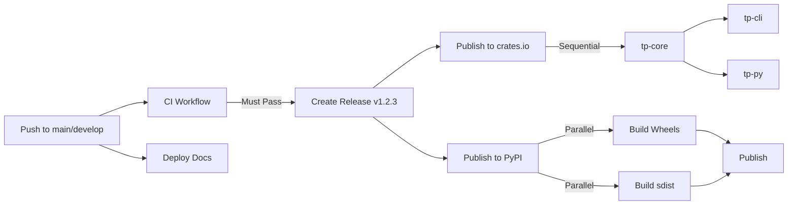

# CI/CD Workflows

This document describes the automated workflows used for continuous integration, deployment, and publishing of the TP-Lib project.

## Overview

The project uses GitHub Actions for automation with the following workflows:

1. **[CI (Continuous Integration)](.github/workflows/ci.yml)** - Build, test, and validate code quality
2. **[Publish to crates.io](.github/workflows/publish-crates.yml)** - Release Rust crates
3. **[Publish to PyPI](.github/workflows/publish-pypi.yml)** - Release Python packages
4. **[Deploy Documentation](.github/workflows/docs.yml)** - Build and deploy API documentation

## Continuous Integration (CI)

**Trigger:** Push or Pull Request to `main` or `develop` branches

**Jobs:**

### Test Suite
- Runs all Rust tests across the workspace
- Executes with `--all-features` to ensure all functionality is tested
- Uses Python 3.12 for PyO3 bindings
- **Status:** ✅ Required check

### Benchmarks
- Runs performance benchmarks
- Ensures no performance regressions
- **Status:** ℹ️ Informational

### Python Tests
- Sets up Python 3.12 environment
- Installs maturin for building Python bindings
- Runs pytest suite for Python package
- **Status:** ✅ Required check

### Linting
- **rustfmt**: Enforces code formatting standards
- **clippy**: Catches common mistakes and suggests improvements
- **Status:** ✅ Required check

### License & Security Check
- Runs `cargo deny check` to verify:
  - ✅ License compatibility (Apache-2.0 compliant)
  - 🔒 Security vulnerabilities (via RustSec database)
  - 📦 Banned dependencies
  - 🌐 Allowed sources (crates.io only)
- See [SECURITY.md](SECURITY.md) for details on known issues
- **Status:** ✅ Required check

**Caching:** All jobs cache Cargo registry, git index, and build artifacts to speed up builds.

## Publishing to crates.io

**File:** [`.github/workflows/publish-crates.yml`](.github/workflows/publish-crates.yml)

**Trigger:** GitHub Release creation with tag matching `v*.*.*` (e.g., `v1.0.0`)

**Process:**

1. **Version Verification**
   - Extracts version from git tag (e.g., `v1.2.3` → `1.2.3`)
   - Compares with version in `Cargo.toml`
   - Fails if versions don't match

2. **Test Execution**
   - Runs full test suite before publishing
   - Ensures release quality

3. **Sequential Publishing**
   - Publishes `tp-core` first (core library)
   - Waits 30 seconds for crates.io indexing
   - Publishes `tp-cli` (depends on tp-core)
   - Publishes `tp-py` (Python bindings, depends on tp-core)

**Authentication:** OIDC Trusted Publishing (no secrets needed)
- The workflow uses OpenID Connect to authenticate with crates.io
- No API tokens need to be stored in GitHub secrets
- Configure trusted publisher at: https://crates.io/settings/tokens

**Usage:**
```bash
# 1. Update version in Cargo.toml files
# 2. Commit changes
git commit -am "chore: bump version to 1.2.3"

# 3. Create and push tag
git tag v1.2.3
git push origin v1.2.3

# 4. Create GitHub Release
# Go to: https://github.com/matdata-eu/tp-lib/releases/new
# - Tag: v1.2.3
# - Title: "Release 1.2.3"
# - Description: Changelog
# - Click "Publish release"
```

## Publishing to PyPI

**File:** [`.github/workflows/publish-pypi.yml`](.github/workflows/publish-pypi.yml)

**Trigger:** GitHub Release creation with tag matching `v*.*.*`

**Process:**

1. **Build Wheels (Multi-platform)**
   - Builds Python wheels for:
     - **Linux** (ubuntu-latest)
     - **Windows** (windows-latest)
     - **macOS** (macos-latest)
   - Python versions: 3.9, 3.10, 3.11, 3.12
   - Uses `maturin` to compile Rust extension module

2. **Build Source Distribution**
   - Creates source tarball (`.tar.gz`)
   - Built on Linux with Python 3.12

3. **Publish to PyPI**
   - Collects all wheels and sdist
   - Uploads to PyPI using OIDC trusted publishing

**Authentication:** OIDC Trusted Publishing (no secrets needed)
- The workflow uses OpenID Connect to authenticate with PyPI
- No API tokens need to be stored in GitHub secrets
- Configure trusted publisher at: https://pypi.org/manage/account/publishing/

**Installation after publishing:**
```bash
pip install tp-lib
```

## Documentation Deployment

**File:** [`.github/workflows/docs.yml`](.github/workflows/docs.yml)

**Trigger:** 
- Push to `main` branch
- Manual workflow dispatch

**Process:**

1. **Build Documentation**
   - Runs `cargo doc --workspace --no-deps --all-features`
   - Generates rustdoc for all crates
   - Includes private items with `--document-private-items`

2. **Create Index Page**
   - Generates `index.html` at root
   - Auto-redirects to `tp_lib_core/index.html`
   - Provides navigation links to all crates

3. **Deploy to GitHub Pages**
   - Uploads to `gh-pages` branch
   - Available at: `https://matdata-eu.github.io/tp-lib/`

**Setup Requirements:**
1. Enable GitHub Pages in repository settings
2. Source: GitHub Actions
3. Configure trusted publishers on crates.io and PyPI (see below)

**Access:** https://matdata-eu.github.io/tp-lib/

## OIDC Trusted Publishing Setup

Both crates.io and PyPI support OIDC (OpenID Connect) trusted publishing with GitHub Actions, eliminating the need to store API tokens as secrets.

### crates.io Setup

1. Go to https://crates.io/settings/tokens
2. Under "Trusted Publishing", click "Add trusted publisher"
3. Fill in:
   - **Repository Owner:** `matdata-eu`
   - **Repository Name:** `tp-lib`
   - **Workflow:** `.github/workflows/publish-crates.yml`
4. Click "Add publisher"

The workflow will automatically authenticate using GitHub's OIDC token when publishing.

### PyPI Setup

1. Go to https://pypi.org/manage/account/publishing/
2. Under "Add a new publisher", fill in:
   - **PyPI Project Name:** `tp-lib`
   - **Owner:** `matdata-eu`
   - **Repository name:** `tp-lib`
   - **Workflow name:** `publish-pypi.yml`
   - **Environment name:** `pypi`
3. Click "Add"

For the initial publication to PyPI (before the project exists), you'll need to:
- Either use a temporary API token for the first release
- Or pre-register the project name on PyPI

After the first release, all subsequent releases will use trusted publishing automatically.

## Workflow Dependencies



## OIDC Trusted Publishing

The workflows use OpenID Connect (OIDC) for secure, token-less authentication:

- **No secrets to manage:** GitHub automatically provides OIDC tokens
- **Better security:** Tokens are short-lived and scoped to specific workflows
- **Automatic rotation:** No need to worry about token expiration

### Configuration

Both crates.io and PyPI must be configured to trust this GitHub repository:

| Platform | Configuration URL |
|----------|------------------|
| crates.io | https://crates.io/settings/tokens |
| PyPI | https://pypi.org/manage/account/publishing/ |

See the "OIDC Trusted Publishing Setup" section above for detailed steps.

## Branch Protection

Recommended branch protection rules for `main`:

- ✅ Require status checks to pass before merging
  - CI / Test Suite
  - CI / Python Tests
  - CI / Linting
  - CI / License & Security Check
- ✅ Require branches to be up to date before merging
- ✅ Require linear history
- ✅ Include administrators

## Release Checklist

Before creating a release:

- [ ] All CI checks passing on `main`
- [ ] Version updated in all `Cargo.toml` files
- [ ] `CHANGELOG.md` updated with release notes
- [ ] `cargo deny check` passes (no security issues)
- [ ] All tests passing locally: `cargo test --all-features`
- [ ] Python tests passing: `cd tp-py && pytest`
- [ ] Documentation builds: `cargo doc --no-deps`
- [ ] Docker builds successfully

Creating a release:

1. **Update versions:**
   ```bash
   # Update Cargo.toml files with new version
   # Update tp-py/Cargo.toml
   # Update tp-py/pyproject.toml
   ```

2. **Commit and tag:**
   ```bash
   git commit -am "chore: release v1.2.3"
   git tag v1.2.3
   git push origin main
   git push origin v1.2.3
   ```

3. **Create GitHub Release:**
   - Go to https://github.com/matdata-eu/tp-lib/releases/new
   - Select tag: `v1.2.3`
   - Add release title: `Release 1.2.3`
   - Add changelog from `CHANGELOG.md`
   - Click "Publish release"

4. **Monitor workflows:**
   - Watch Actions tab for workflow execution
   - Verify crates.io publication
   - Verify PyPI publication
   - Verify documentation deployment

## Troubleshooting

### Workflow fails on cargo deny

**Problem:** Security vulnerabilities detected

**Solution:** 
- Check [SECURITY.md](SECURITY.md) for known issues
- Update dependencies: `cargo update`
- If transitive, add to `deny.toml` ignore list with justification

### PyPI publish fails

**Problem:** Package already exists

**Solution:** 
- Ensure version was incremented
- PyPI doesn't allow re-uploading same version

### Documentation not updating

**Problem:** GitHub Pages shows old docs

**Solution:**
- Check workflow logs for errors
- Verify GitHub Pages is enabled
- Try manual trigger: Actions → Deploy Documentation → Run workflow

### Version mismatch in release

**Problem:** Tag version doesn't match Cargo.toml

**Solution:**
```bash
# Update all Cargo.toml files
vim Cargo.toml tp-core/Cargo.toml tp-cli/Cargo.toml tp-py/Cargo.toml

# Commit
git commit -am "chore: fix version to 1.2.3"

# Delete and recreate tag
git tag -d v1.2.3
git push origin :refs/tags/v1.2.3
git tag v1.2.3
git push origin v1.2.3
```

## Contributing

When contributing, ensure:

1. All CI checks pass on your branch
2. Code is formatted: `cargo fmt --all`
3. No clippy warnings: `cargo clippy --all-targets --all-features`
4. Tests pass: `cargo test --all-features`
5. License check passes: `cargo deny check`

## Monitoring

Monitor workflow status:

- **Actions Tab:** https://github.com/matdata-eu/tp-lib/actions
- **crates.io:** https://crates.io/crates/tp-core
- **PyPI:** https://pypi.org/project/tp-lib/
- **Documentation:** https://matdata-eu.github.io/tp-lib/

---

For questions or issues with CI/CD, please open an issue on GitHub.
