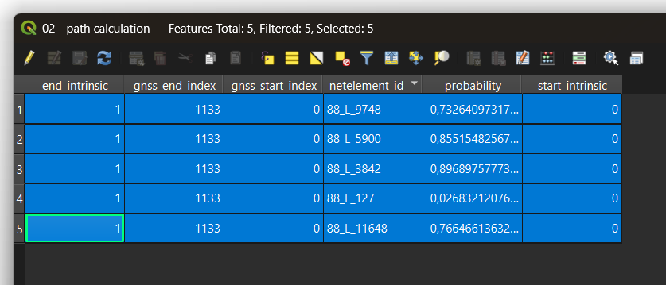
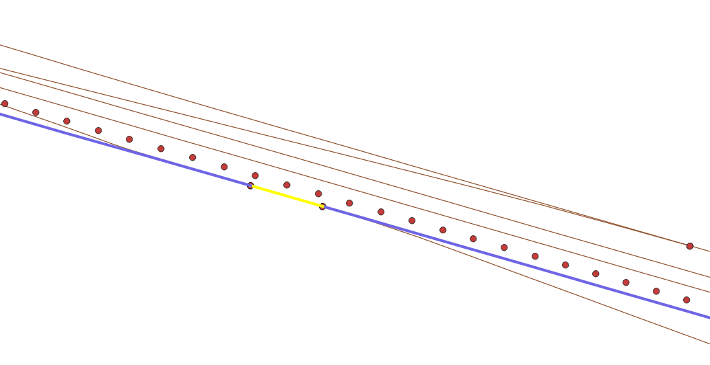
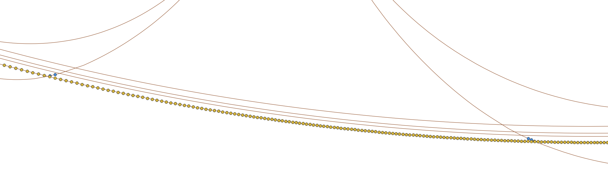

# This folder contains test-data with manually curated data and real train positions

Root folder for release exe files: target/release/

## The network file

The file `network_airport.geojson` contains a subpart of the Belgian railway network around the airport of Brussels/Zaventem. The tracks going to the airport are underground. At the same time there are tracks above ground but sometimes overcrossed by roads. 

Here's a GIS visualisation containing openstreetmap


In order to better see the tracks, find below a visualisation without background. Note: the red dots are the netrelations (switches):


## Sample data

The files `sample_gnss.geojson`and `sample_network.geojson` only serve for educational reasons.

## Easy cases 

### L36 track B (not taking any switches)

Log file ID: 28876

#### The GNSS data

Relatively clean GNSS data, train traveling from Leuven to Brussels on line 36, track B. The GNSS positions (green) are slightly offset to the north:


#### Simple projection

Tests to demonstrate how the simple projection works and where it fails (look at North going switches).

```bash
tp-cli.exe simple-projection --gnss test-data/log_28876_L36-B.csv --crs EPSG:4326 --network test-data/network_airport.geojson --output test-data/log_28876_L36-B-simple-projection.geojson
```

The result is good, all GNSS positions are projected on the closest netelement. Note that this yields the expected outcome of GNSS projections on connecting tracks (red rectangles) and jumping back to the main track.


#### Path calculation

Output should be a simple concatenation of all the netelements with a high probability. 

```bash
tp-cli.exe --gnss test-data/log_28876_L36-B.csv --path-calculation --crs EPSG:4326 --network test-data/network_airport.geojson --output test-data/log_28876_L36-B-path-calculation.geojson
```

Output is correct:
1. 88_L_3842
2. 88_L_5900
3. 88_L_11648
4. 88_L_127
5. 88_L_9748



Note the very low probability for 88_L_127. This is due to it being a very short netelement that connects two switches and only has a very limited number of GPS coordinates on it:



We might need to revise the algorithm later because of this.

#### Path projection

Finally we can evaluate the performance of projecting the coordinates onto the calculated path:

```bash
tp-cli.exe --gnss test-data/log_28876_L36-B.csv --crs EPSG:4326 --network test-data/network_airport.geojson --output test-data/log_28876_L36-B-path-projection.geojson
```



In gold the path projected coordinates. In blue the result of the simple projection as reference. We conclude that path projection yields better results than simple projection.
