# Test data: manually curated data and real train positions

Each log has its own subdirectory (`log_XXXXX/`) containing the source GNSS CSV and the three computed GeoJSON outputs.

- [Test data: manually curated data and real train positions](#test-data-manually-curated-data-and-real-train-positions)
  - [The network file](#the-network-file)
  - [Sample data](#sample-data)
  - [CLI quick reference](#cli-quick-reference)
  - [Simple projection, path calculation \& path projection](#simple-projection-path-calculation--path-projection)
    - [L36 track B – log\_28876](#l36-track-b--log_28876)
      - [The GNSS data](#the-gnss-data)
      - [Simple projection](#simple-projection)
      - [Path calculation](#path-calculation)
      - [Path projection](#path-projection)
    - [L36 track A – log\_29083](#l36-track-a--log_29083)
      - [The GNSS data](#the-gnss-data-1)
      - [Simple projection](#simple-projection-1)
      - [Path calculation](#path-calculation-1)
      - [Path projection](#path-projection-1)
    - [L36-A → L36C-A – log\_28554](#l36-a--l36c-a--log_28554)
      - [Simple projection](#simple-projection-2)
      - [Path calculation](#path-calculation-2)
      - [Path projection](#path-projection-2)
    - [L36-B → L36N-B – log\_29304](#l36-b--l36n-b--log_29304)
      - [Simple projection](#simple-projection-3)
      - [Path calculation](#path-calculation-3)
      - [Path projection](#path-projection-3)
    - [L36C-B → L36-A – log\_30908](#l36c-b--l36-a--log_30908)
      - [Simple projection](#simple-projection-4)
      - [Path calculation](#path-calculation-4)
      - [Path projection](#path-projection-4)
    - [L25N-B → L36C-B – log\_31176](#l25n-b--l36c-b--log_31176)
      - [Simple projection](#simple-projection-5)
      - [Path calculation](#path-calculation-5)
      - [Path projection](#path-projection-5)
    - [L36-B → L36N-B – log\_32870](#l36-b--l36n-b--log_32870)
      - [Simple projection](#simple-projection-6)
      - [Path calculation](#path-calculation-6)
      - [Path projection](#path-projection-6)
    - [L36-B → L36C-B → L25N-A – log\_31241](#l36-b--l36c-b--l25n-a--log_31241)
      - [Simple projection](#simple-projection-7)
      - [Path calculation](#path-calculation-7)
      - [Path projection](#path-projection-7)
    - [L36-A → L36C-A → L25N-B – log\_28573](#l36-a--l36c-a--l25n-b--log_28573)
      - [Simple projection](#simple-projection-8)
      - [Path calculation](#path-calculation-8)
      - [Path projection](#path-projection-8)
    - [L36-A → L36C-A → L25N-B – log\_29584](#l36-a--l36c-a--l25n-b--log_29584)
      - [Simple projection](#simple-projection-9)
      - [Path calculation](#path-calculation-9)
      - [Path projection](#path-projection-9)
    - [L36-A → L36C-A → L25N-B – log\_29835](#l36-a--l36c-a--l25n-b--log_29835)
      - [Simple projection](#simple-projection-10)
      - [Path calculation](#path-calculation-10)
      - [Path projection](#path-projection-10)
    - [L36-A → L36C-A → L25N-B – log\_31259](#l36-a--l36c-a--l25n-b--log_31259)
    - [L36-A → L36C-A → L25N-B, very bad GNSS – log\_28586](#l36-a--l36c-a--l25n-b-very-bad-gnss--log_28586)
      - [Simple projection](#simple-projection-11)
      - [Path calculation](#path-calculation-11)
      - [Path projection](#path-projection-11)
  - [Path reviewed](#path-reviewed)
    - [L36-A → L36C-A → L25N-B – log\_28573-path-review](#l36-a--l36c-a--l25n-b--log_28573-path-review)
      - [Original path calculation](#original-path-calculation)
      - [Path review process](#path-review-process)
      - [Path projection](#path-projection-12)
  - [Path with train detections](#path-with-train-detections)
    - [L36-A → L36C-A → L25N-B – log\_28573-detections](#l36-a--l36c-a--l25n-b--log_28573-detections)
      - [Original path calculation](#original-path-calculation-1)
      - [Adding train detections](#adding-train-detections)
      - [Reviewing train detections](#reviewing-train-detections)

Root folder for release exe: `target/release/`

## The network file

The file `network_airport.geojson` contains a subpart of the Belgian railway network around the airport of Brussels/Zaventem. The tracks going to the airport are underground. At the same time there are tracks above ground but sometimes overcrossed by roads. 

Here's a GIS visualisation containing openstreetmap


In order to better see the tracks, find below a visualisation without background. Note: the red dots are the netrelations (switches):


## Sample data

The files `sample_gnss.geojson` and `sample_network.geojson` only serve for educational reasons.

## CLI quick reference

The three operations available via `tp-cli` are:

| Operation | Command | Description |
|-----------|---------|-------------|
| Simple projection | `tp-cli simple-projection ...` | Projects each GNSS point onto the nearest netelement (legacy) |
| Path calculation | `tp-cli calculate-path ...` | Calculates the most likely sequence of netelements without projecting |
| Path projection | `tp-cli ...` (no subcommand) | Full pipeline: calculates path then projects GNSS positions onto it |

Common flags: `--gnss <FILE>`, `--network <FILE>`, `--crs EPSG:4326`, `--output <FILE>` (`.geojson` extension auto-selects GeoJSON format).

## Simple projection, path calculation & path projection

### L36 track B – log_28876

Log file ID: 28876

#### The GNSS data

Relatively clean GNSS data, train traveling from Leuven to Brussels on line 36, track B. The GNSS positions (green) are slightly offset to the north:


#### Simple projection

Tests to demonstrate how the simple projection works and where it fails (look at North going switches).

```bash
target/release/tp-cli.exe simple-projection --gnss test-data/log_28876/log_28876_L36-B.csv --crs EPSG:4326 --network test-data/network_airport.geojson --output test-data/log_28876/log_28876_L36-B-simple-projection.geojson
```

The result is good, all GNSS positions are projected on the closest netelement. Note that this yields the expected outcome of GNSS projections on connecting tracks (red rectangles) and jumping back to the main track.


#### Path calculation

Output should be a simple concatenation of all the netelements with a high probability. 

```bash
target/release/tp-cli.exe calculate-path --gnss test-data/log_28876/log_28876_L36-B.csv --crs EPSG:4326 --network test-data/network_airport.geojson --output test-data/log_28876/log_28876_L36-B-path-calculation.geojson
```

Output is correct:
1. 88_L_3842  (prob=0.897)
2. 88_L_5900  (prob=0.855)
3. 88_L_11648 (prob=0.766)
4. 88_L_127   (prob=0.027)
5. 88_L_9748  (prob=0.733)


Note the very low probability for 88_L_127. This is due to it being a very short netelement that connects two switches and only has a very limited number of GPS coordinates on it:


We might need to revise the algorithm later because of this.

#### Path projection

Finally we can evaluate the performance of projecting the coordinates onto the calculated path:

```bash
target/release/tp-cli.exe --gnss test-data/log_28876/log_28876_L36-B.csv --crs EPSG:4326 --network test-data/network_airport.geojson --output test-data/log_28876/log_28876_L36-B-path-projection.geojson
```


In gold the path projected coordinates. In blue the result of the simple projection as reference. We conclude that path projection yields better results than simple projection.

---

### L36 track A – log_29083

Log file ID: 29083

#### The GNSS data

Relatively dirty GNSS data, train traveling from Brussels to Leuven on line 36, track A. The GNSS positions (green) jump about 200m away from the track center:


#### Simple projection

```bash
target/release/tp-cli.exe simple-projection --gnss test-data/log_29083/log_29083_L36-A.csv --crs EPSG:4326 --network test-data/network_airport.geojson --output test-data/log_29083/log_29083_L36-A-simple-projection.geojson
```

We see exactly what we would predict, the simple projection algorithm will think the train is going towards the airport station:


#### Path calculation

```bash
target/release/tp-cli.exe calculate-path --gnss test-data/log_29083/log_29083_L36-A.csv --crs EPSG:4326 --network test-data/network_airport.geojson --output test-data/log_29083/log_29083_L36-A-path-calculation.geojson
```

Output is correct, no surprises:
1. 88_L_5916 (prob=0.629)
2. 88_L_2026  (prob=1.000)
3. 88_L_42    (prob=0.667)
4. 88_L_111   (prob=0.712)
5. 88_L_155   (prob=0.842)


We see a steady probability on all the path elements, even on the short connection between two switches on the main track:


#### Path projection

```bash
target/release/tp-cli.exe --gnss test-data/log_29083/log_29083_L36-A.csv --crs EPSG:4326 --network test-data/network_airport.geojson --output test-data/log_29083/log_29083_L36-A-path-projection.geojson
```

No surprises. The blue dots are again the simple-projection result while the gold dots are the path processed coordinates:


### L36-A → L36C-A – log_28554

Log file ID: 28554

Train takes a single switch from L36 track A onto the L36C line towards the airport (track A). Due to the tunnel, the raw GNSS positions start to drift near the end of the path:


#### Simple projection

Considering the simple layout and path, the simple projection will result already in an optimal result:

```bash
target/release/tp-cli.exe simple-projection --gnss test-data/log_28554/log_28554_L36-A_to_L36C-A.csv --crs EPSG:4326 --network test-data/network_airport.geojson --output test-data/log_28554/log_28554_L36-A_to_L36C-A-simple-projection.geojson
```


#### Path calculation

Path calculation gives the expected result.

```bash
target/release/tp-cli.exe calculate-path --gnss test-data/log_28554/log_28554_L36-A_to_L36C-A.csv --crs EPSG:4326 --network test-data/network_airport.geojson --output test-data/log_28554/log_28554_L36-A_to_L36C-A-path-calculation.geojson
```

All path elements score a high probability.


#### Path projection

No surprises here:

```bash
target/release/tp-cli.exe --gnss test-data/log_28554/log_28554_L36-A_to_L36C-A.csv --crs EPSG:4326 --network test-data/network_airport.geojson --output test-data/log_28554/log_28554_L36-A_to_L36C-A-path-projection.geojson
```


---

### L36-B → L36N-B – log_29304

Log file ID: 29304

Train drives from Leuven to Brussels, initially driving on L36 track B and moving over to L36N track B after the airport junction. GNSS data is relatively clean:


#### Simple projection

```bash
target/release/tp-cli.exe simple-projection --gnss test-data/log_29304/log_29304_L36-B_to_L36N-B.csv --crs EPSG:4326 --network test-data/network_airport.geojson --output test-data/log_29304/log_29304_L36-B_to_L36N-B-simple-projection.geojson
```


#### Path calculation

```bash
target/release/tp-cli.exe calculate-path --gnss test-data/log_29304/log_29304_L36-B_to_L36N-B.csv --crs EPSG:4326 --network test-data/network_airport.geojson --output test-data/log_29304/log_29304_L36-B_to_L36N-B-path-calculation.geojson
```

Expected output:
1. 88_L_9749  (prob=0.842)
2. 88_L_9670  (prob=0.601)
3. 88_L_16908 (prob=0.592)
4. 88_L_2016  (prob=0.411)
5. 88_L_5900  (prob=0.789)
6. 88_L_3842  (prob=0.807)


#### Path projection

```bash
target/release/tp-cli.exe --gnss test-data/log_29304/log_29304_L36-B_to_L36N-B.csv --crs EPSG:4326 --network test-data/network_airport.geojson --output test-data/log_29304/log_29304_L36-B_to_L36N-B-path-projection.geojson
```


---

### L36C-B → L36-A – log_30908

Log file ID: 30908

Train starts from L36C track B and merges onto L36 track A. The GNSS positions are very bad at the start until the train is out of the tunnel.


#### Simple projection

```bash
target/release/tp-cli.exe simple-projection --gnss test-data/log_30908/log_30908_L36C-B_to_L36-A.csv --crs EPSG:4326 --network test-data/network_airport.geojson --output test-data/log_30908/log_30908_L36C-B_to_L36-A-simple-projection.geojson
```

Simple projection gives decent results:


#### Path calculation

```bash
target/release/tp-cli.exe calculate-path --gnss test-data/log_30908/log_30908_L36C-B_to_L36-A.csv --crs EPSG:4326 --network test-data/network_airport.geojson --output test-data/log_30908/log_30908_L36C-B_to_L36-A-path-calculation.geojson
```

Path calculation is as it should be:


#### Path projection

```bash
target/release/tp-cli.exe --gnss test-data/log_30908/log_30908_L36C-B_to_L36-A.csv --crs EPSG:4326 --network test-data/network_airport.geojson --output test-data/log_30908/log_30908_L36C-B_to_L36-A-path-projection.geojson
```

No surprises with path projection:


---

### L25N-B → L36C-B – log_31176

Log file ID: 31176

Starting on L25N track B and merging onto L36C track B. A switch and an overcrossing. GNSS positions are drifting off, when going into the tunnel.

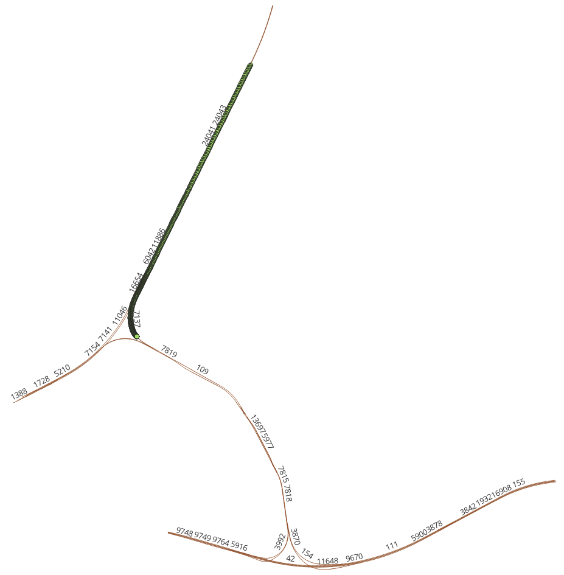

Detail of drifting off:

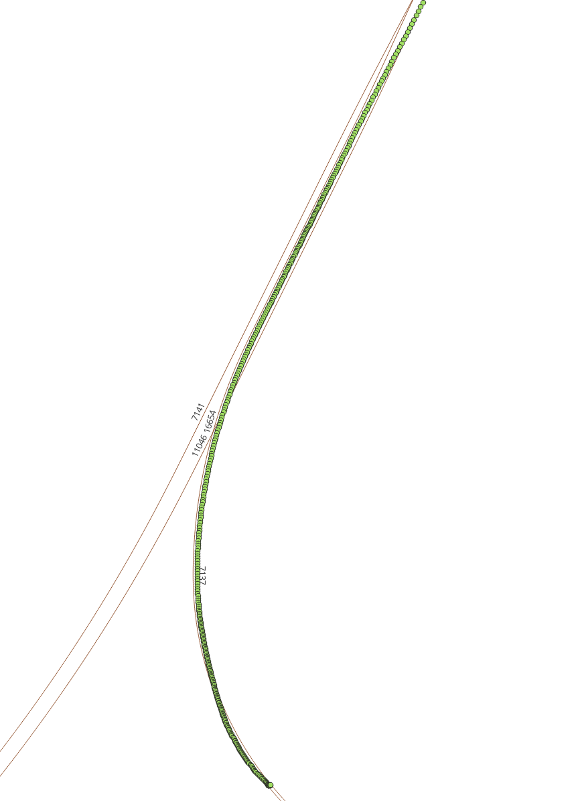


#### Simple projection

```bash
target/release/tp-cli.exe simple-projection --gnss test-data/log_31176/log_31176_25N-B_to_L36C-B.csv --crs EPSG:4326 --network test-data/network_airport.geojson --output test-data/log_31176/log_31176_25N-B_to_L36C-B-simple-projection.geojson
```

Simple projection has the issue of jumping from track to track:


#### Path calculation

```bash
target/release/tp-cli.exe calculate-path --gnss test-data/log_31176/log_31176_25N-B_to_L36C-B.csv --crs EPSG:4326 --network test-data/network_airport.geojson --output test-data/log_31176/log_31176_25N-B_to_L36C-B-path-calculation.geojson
```

Path calculation is as it should:


#### Path projection

```bash
target/release/tp-cli.exe --gnss test-data/log_31176/log_31176_25N-B_to_L36C-B.csv --crs EPSG:4326 --network test-data/network_airport.geojson --output test-data/log_31176/log_31176_25N-B_to_L36C-B-path-projection.geojson
```

Path projection is good:


---

### L36-B → L36N-B – log_32870

Log file ID: 32870

Short section, moving from L36 track B to L36N track B.

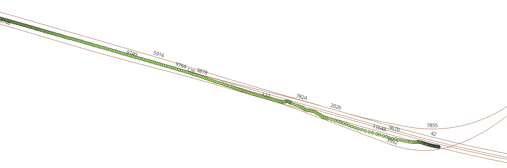

#### Simple projection

```bash
target/release/tp-cli.exe simple-projection --gnss test-data/log_32870/log_32870_L36-B_to_L36N-B.csv --crs EPSG:4326 --network test-data/network_airport.geojson --output test-data/log_32870/log_32870_L36-B_to_L36N-B-simple-projection.geojson
```


#### Path calculation

```bash
target/release/tp-cli.exe calculate-path --gnss test-data/log_32870/log_32870_L36-B_to_L36N-B.csv --crs EPSG:4326 --network test-data/network_airport.geojson --output test-data/log_32870/log_32870_L36-B_to_L36N-B-path-calculation.geojson
```


#### Path projection

```bash
target/release/tp-cli.exe --gnss test-data/log_32870/log_32870_L36-B_to_L36N-B.csv --crs EPSG:4326 --network test-data/network_airport.geojson --output test-data/log_32870/log_32870_L36-B_to_L36N-B-path-projection.geojson
```


---

### L36-B → L36C-B → L25N-A – log_31241

Log file ID: 31241

More difficult GNSS sequence. Train comes from Leuven, goes through the airport towards Antwerp. Contains many different problematic path decisions. Exact path is unknown but the library should output a best guess:

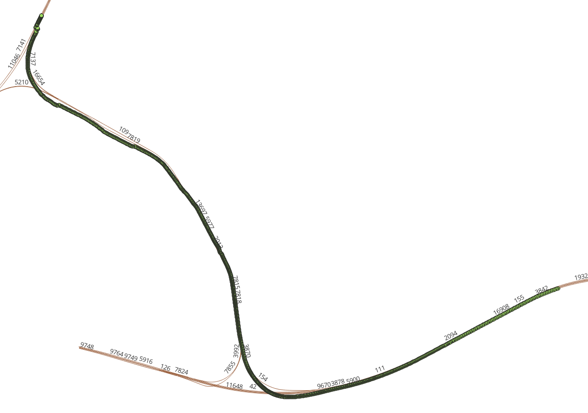

First takes the junction towards airport:

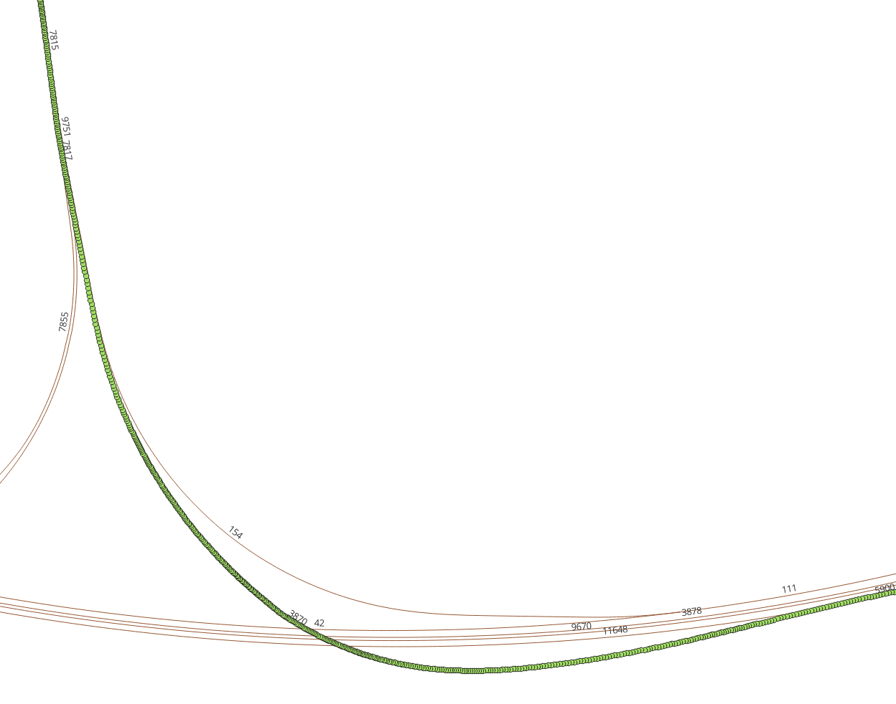

Then seems to switch tracks on L36C:

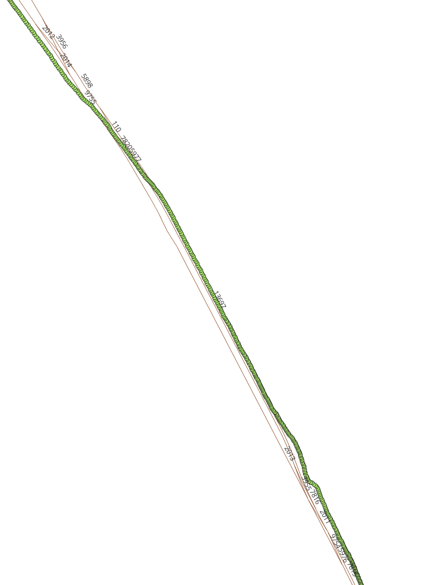

Then exists the airport tunnel and regains a better GNSS solution:

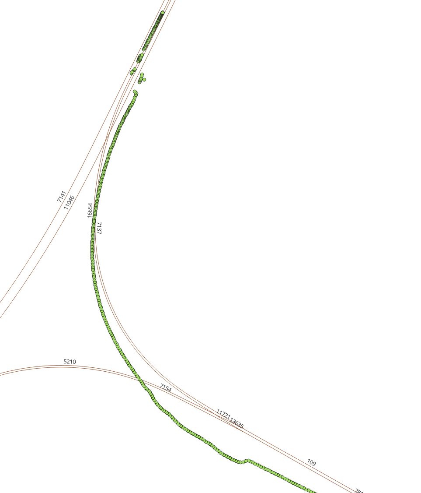

#### Simple projection

```bash
target/release/tp-cli.exe simple-projection --gnss test-data/log_31241/log_31241_L36-B_to_L36C-B_to_L25N-A.csv --crs EPSG:4326 --network test-data/network_airport.geojson --output test-data/log_31241/log_31241_L36-B_to_L36C-B_to_L25N-A-simple-projection.geojson
```

Obviously, the simple projection will not yield a good result:


#### Path calculation

```bash
target/release/tp-cli.exe calculate-path --gnss test-data/log_31241/log_31241_L36-B_to_L36C-B_to_L25N-A.csv --crs EPSG:4326 --network test-data/network_airport.geojson --output test-data/log_31241/log_31241_L36-B_to_L36C-B_to_L25N-A-path-calculation.geojson
```


#### Path projection

```bash
target/release/tp-cli.exe --gnss test-data/log_31241/log_31241_L36-B_to_L36C-B_to_L25N-A.csv --crs EPSG:4326 --network test-data/network_airport.geojson --output test-data/log_31241/log_31241_L36-B_to_L36C-B_to_L25N-A-path-projection.geojson
```

Returns the expected result

---

### L36-A → L36C-A → L25N-B – log_28573

Log file ID: 28573

This is a very difficult GNSS sequence. Train start on L36 track A from Brussels to Leuven, goes thorugh the airport and exists towards Brussels again.

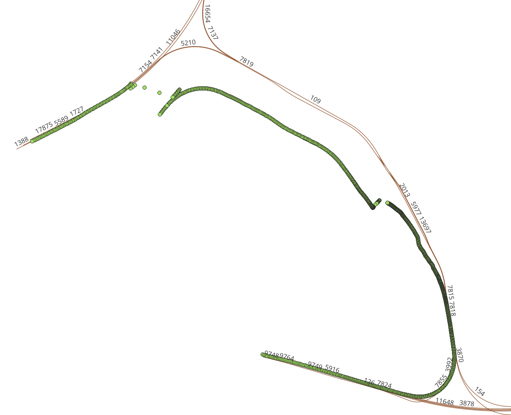

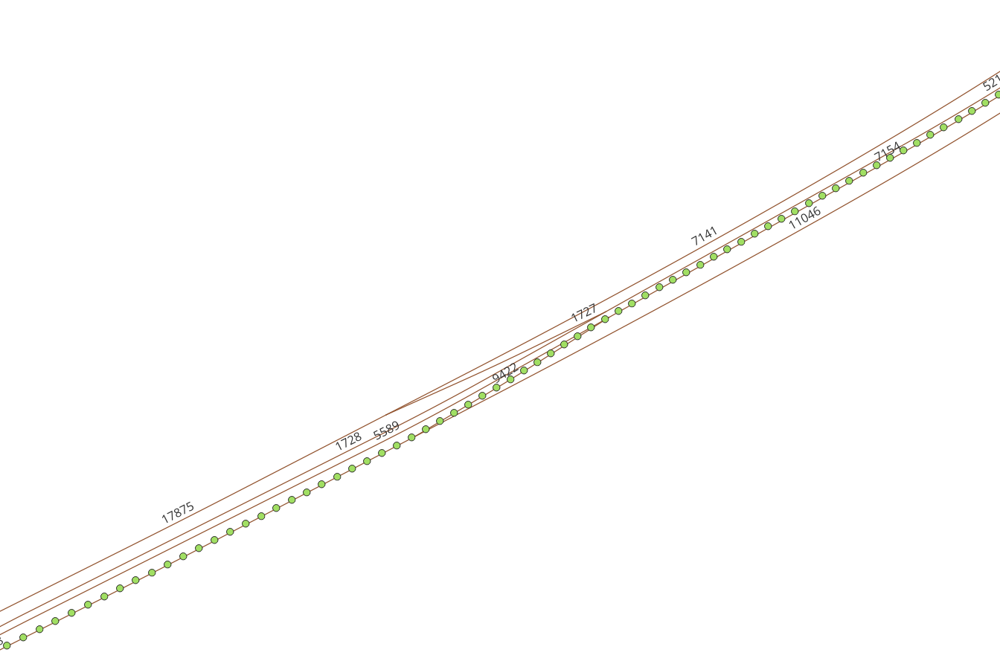


#### Simple projection

```bash
target/release/tp-cli.exe simple-projection --gnss test-data/log_28573/log_28573_L36-A_to_L36C-A_to_L25N-B.csv --crs EPSG:4326 --network test-data/network_airport.geojson --output test-data/log_28573/log_28573_L36-A_to_L36C-A_to_L25N-B-simple-projection.geojson
```

Expected result:


#### Path calculation

```bash
target/release/tp-cli.exe calculate-path --gnss test-data/log_28573/log_28573_L36-A_to_L36C-A_to_L25N-B.csv --crs EPSG:4326 --network test-data/network_airport.geojson --output test-data/log_28573/log_28573_L36-A_to_L36C-A_to_L25N-B-path-calculation.geojson
```

Good result:


#### Path projection

```bash
target/release/tp-cli.exe --gnss test-data/log_28573/log_28573_L36-A_to_L36C-A_to_L25N-B.csv --crs EPSG:4326 --network test-data/network_airport.geojson --output test-data/log_28573/log_28573_L36-A_to_L36C-A_to_L25N-B-path-projection.geojson
```

Good result:


---

### L36-A → L36C-A → L25N-B – log_29584

Log file ID: 29584

Same route as log_28573. Also difficult situation but it will prove that the path algorithm can recover when the GNSS connection improves. 

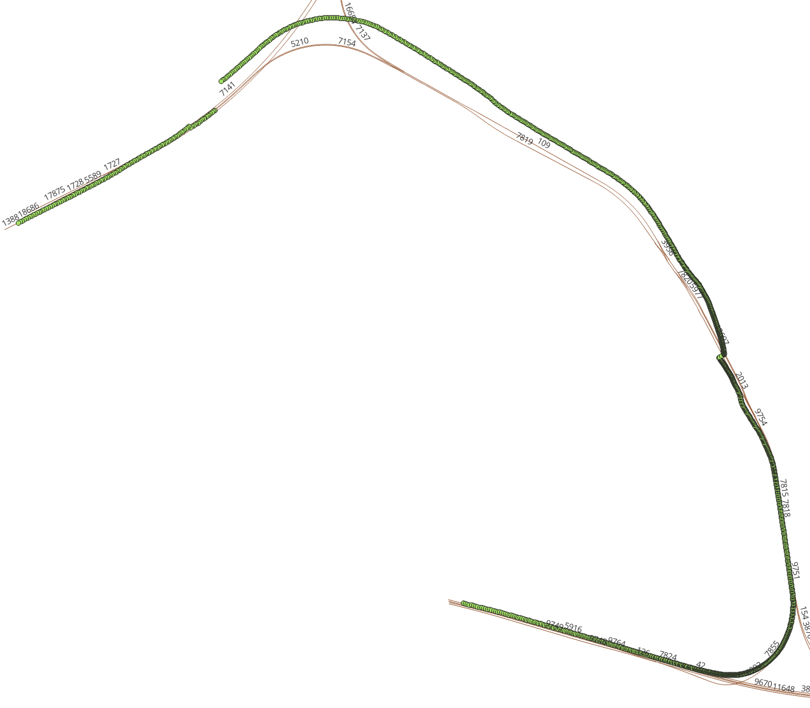


#### Simple projection

```bash
target/release/tp-cli.exe simple-projection --gnss test-data/log_29584/log_29584_L36-A_to_L36C-A_to_L25N-B.csv --crs EPSG:4326 --network test-data/network_airport.geojson --output test-data/log_29584/log_29584_L36-A_to_L36C-A_to_L25N-B-simple-projection.geojson
```

Expected (bad) result:


#### Path calculation

```bash
target/release/tp-cli.exe calculate-path --gnss test-data/log_29584/log_29584_L36-A_to_L36C-A_to_L25N-B.csv --crs EPSG:4326 --network test-data/network_airport.geojson --output test-data/log_29584/log_29584_L36-A_to_L36C-A_to_L25N-B-path-calculation.geojson
```

Good result:


#### Path projection

```bash
target/release/tp-cli.exe --gnss test-data/log_29584/log_29584_L36-A_to_L36C-A_to_L25N-B.csv --crs EPSG:4326 --network test-data/network_airport.geojson --output test-data/log_29584/log_29584_L36-A_to_L36C-A_to_L25N-B-path-projection.geojson
```

Good result (and proves the need to have longitudinal redistribution of the gnss positions):


---

### L36-A → L36C-A → L25N-B – log_29835

Log file ID: 29835

Similar route as log_28573. GNSS is of better quality.

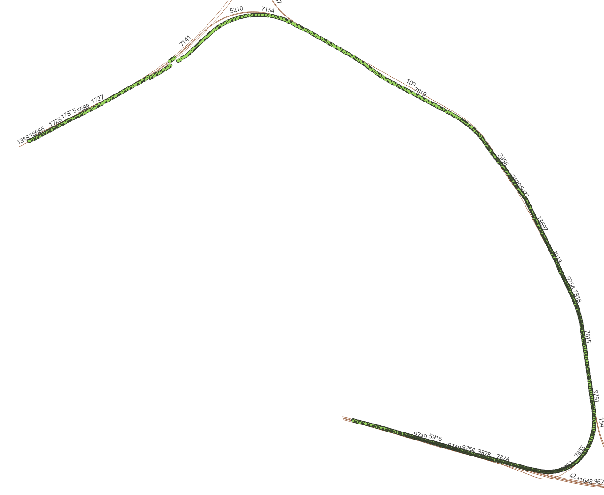

#### Simple projection

```bash
target/release/tp-cli.exe simple-projection --gnss test-data/log_29835/log_29835_L36-A_to_L36C-A_to_L25N-B.csv --crs EPSG:4326 --network test-data/network_airport.geojson --output test-data/log_29835/log_29835_L36-A_to_L36C-A_to_L25N-B-simple-projection.geojson
```

As expected:


#### Path calculation

```bash
target/release/tp-cli.exe calculate-path --gnss test-data/log_29835/log_29835_L36-A_to_L36C-A_to_L25N-B.csv --crs EPSG:4326 --network test-data/network_airport.geojson --output test-data/log_29835/log_29835_L36-A_to_L36C-A_to_L25N-B-path-calculation.geojson
```

Good result:


#### Path projection

```bash
target/release/tp-cli.exe --gnss test-data/log_29835/log_29835_L36-A_to_L36C-A_to_L25N-B.csv --crs EPSG:4326 --network test-data/network_airport.geojson --output test-data/log_29835/log_29835_L36-A_to_L36C-A_to_L25N-B-path-projection.geojson
```

Good result:


---

### L36-A → L36C-A → L25N-B – log_31259

Log file ID: 31259

Same route as log_28573. Quality of GNSS is also relatively good, small drift near the station of the airport. No screenshots because nothing special to report.

---

### L36-A → L36C-A → L25N-B, very bad GNSS – log_28586

Log file ID: 28586

Coming from Brussels towards Leuven, taking the junction to the airport and then returning to Brussels again. The GNSS solution is in very bad shape:

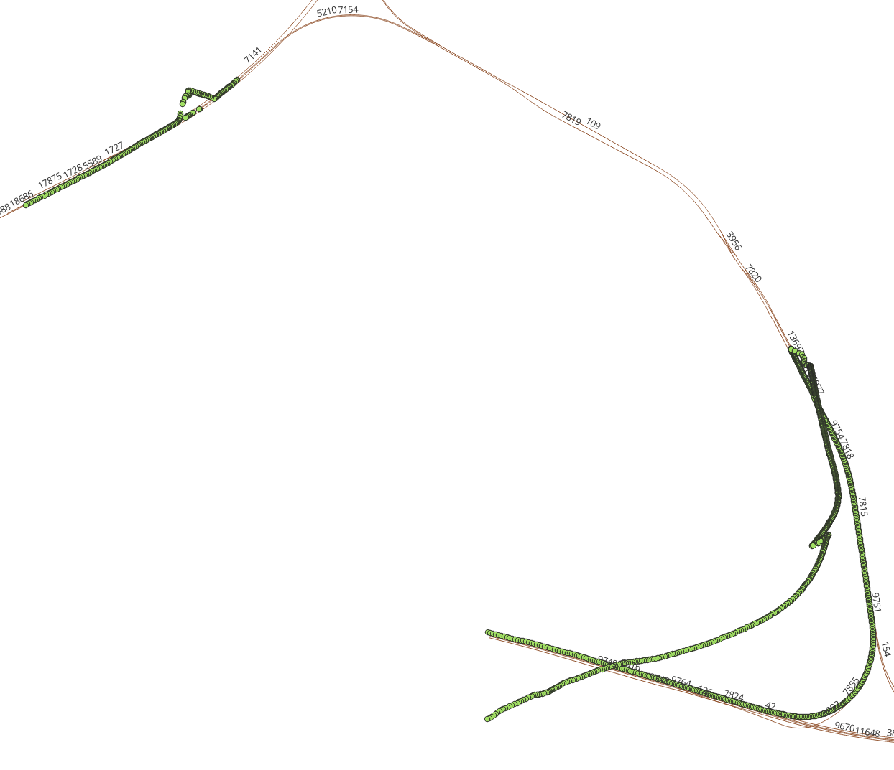

Zoom in on problem area:

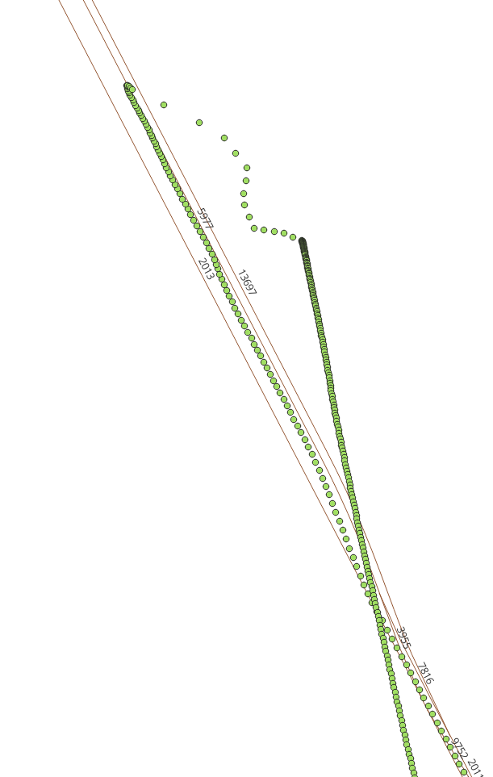


#### Simple projection

```bash
target/release/tp-cli.exe simple-projection --gnss test-data/log_28586/log_28586_L36-A_to_L36C-A_to_L25N-B-very-bad.csv --crs EPSG:4326 --network test-data/network_airport.geojson --output test-data/log_28586/log_28586_L36-A_to_L36C-A_to_L25N-B-very-bad-simple-projection.geojson
```

Expected result:

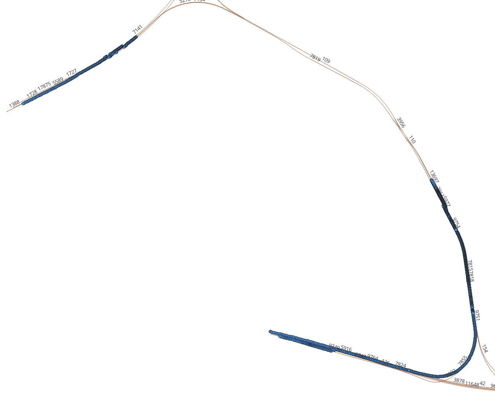

#### Path calculation

```bash
target/release/tp-cli.exe calculate-path --gnss test-data/log_28586/log_28586_L36-A_to_L36C-A_to_L25N-B-very-bad.csv --crs EPSG:4326 --network test-data/network_airport.geojson --output test-data/log_28586/log_28586_L36-A_to_L36C-A_to_L25N-B-very-bad-path-calculation.geojson
```

Good result:

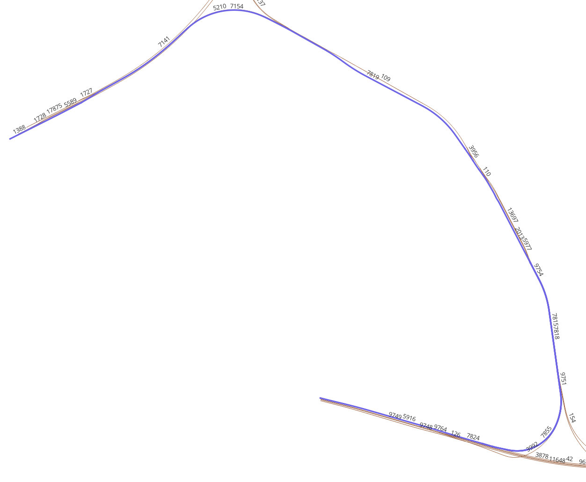

Zoom on detail:

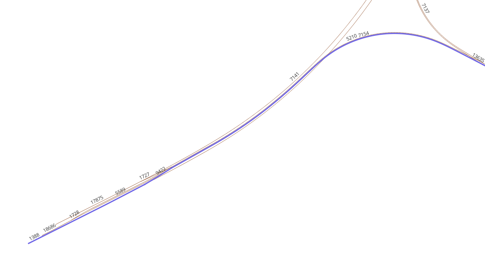

#### Path projection

```bash
target/release/tp-cli.exe --gnss test-data/log_28586/log_28586_L36-A_to_L36C-A_to_L25N-B-very-bad.csv --crs EPSG:4326 --network test-data/network_airport.geojson --output test-data/log_28586/log_28586_L36-A_to_L36C-A_to_L25N-B-very-bad-path-projection.geojson
```

Expected result, again showing the need to also perform longitudinal post processing:

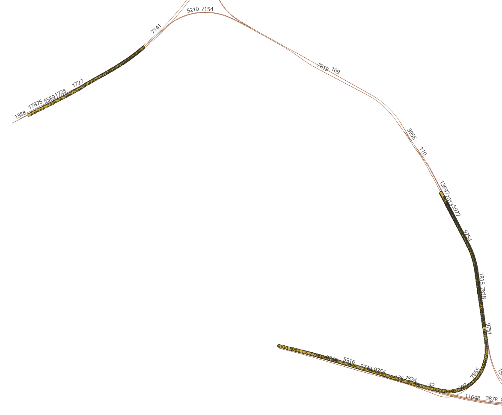

---

## Path reviewed

### L36-A → L36C-A → L25N-B – log_28573-path-review

Log file ID: 28573

We are going to test the new path-review feature on this test-data set. As explained before, this is a very difficult GNSS sequence. Train start on L36 track A from Brussels to Leuven, goes through the airport and exists towards Brussels again.

This is the path


#### Original path calculation

The original path:


#### Path review process

After executing the command (notice the additional `--review` flag):

```bash
target/release/tp-cli.exe --gnss test-data/log_28573-path-review/log_28573_L36-A_to_L36C-A_to_L25N-B.csv --crs EPSG:4326 --network test-data/network_airport.geojson --output test-data/log_28573-path-review/log_28573_L36-A_to_L36C-A_to_L25N-B-reviewed.geojson --review
```

A browser window will open and allow the user to modify the calculated train path. For this example, we are going to correct the train path so that the train takes the middle track in the airport station:


The resulting path can be presented in a GIS application:

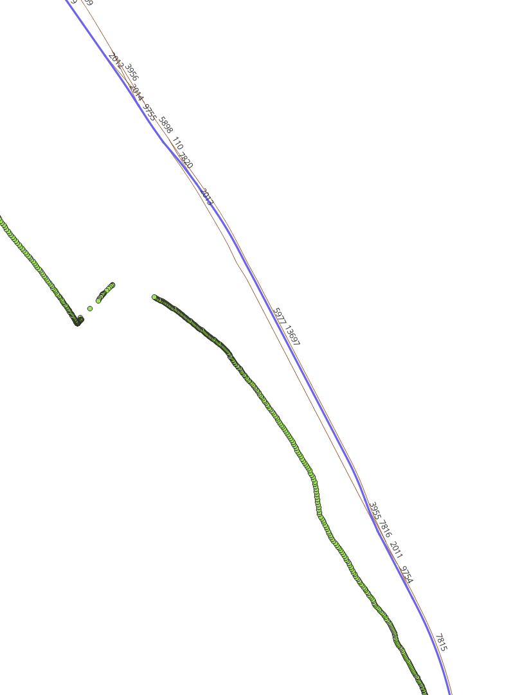


#### Path projection

The result:

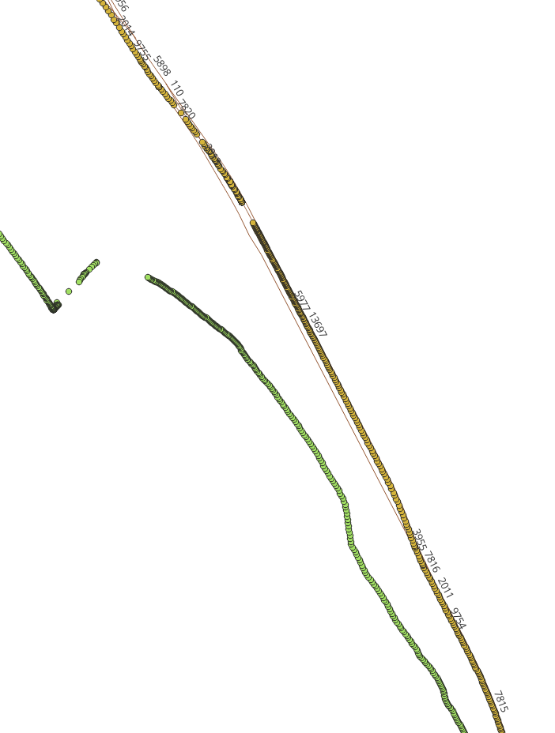

---

## Path with train detections

### L36-A → L36C-A → L25N-B – log_28573-detections

Log file ID: 28573

We are going to test the new train detections feature on this test-data set. As explained before, this is a very difficult GNSS sequence. Train start on L36 track A from Brussels to Leuven, goes through the airport and exists towards Brussels again.

This is the original gnss trace:


#### Original path calculation

The original path:


#### Adding train detections

We add a file with a sample detection:

```csv
timestamp,netelement_id,intrinsic,id,source
2022-01-14T10:50:02+00:00,88_L_5977,0.5,beacon-7,BTM-A1
```

After executing the command:

```bash
target/release/tp-cli.exe calculate-path --crs EPSG:4326 --gnss test-data/log_28573/log_28573_L36-A_to_L36C-A_to_L25N-B.csv --network test-data/network_airport.geojson -o test-data/log_28573-detections/log_28573_L36-A_to_L36C-A_to_L25N-B-path-calculation-with-detection.geojson --punctual-detections test-data/log_28573-detections/sample-detections.csv
```

The resultign trainpath:

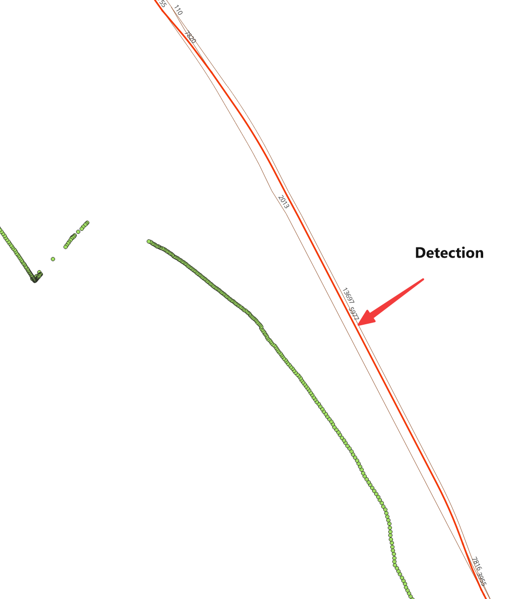


#### Reviewing train detections

After executing the command (notice the additional `--review` flag):

```bash
target/release/tp-cli.exe calculate-path --crs EPSG:4326 --gnss test-data/log_28573/log_28573_L36-A_to_L36C-A_to_L25N-B.csv --network test-data/network_airport.geojson -o test-data/log_28573-detections/log_28573_L36-A_to_L36C-A_to_L25N-B-path-calculation-with-detection.geojson --punctual-detections test-data/log_28573-detections/sample-detections.csv --review
```

A browser window will open and allow the user to modify the calculated train path and see the train detections:

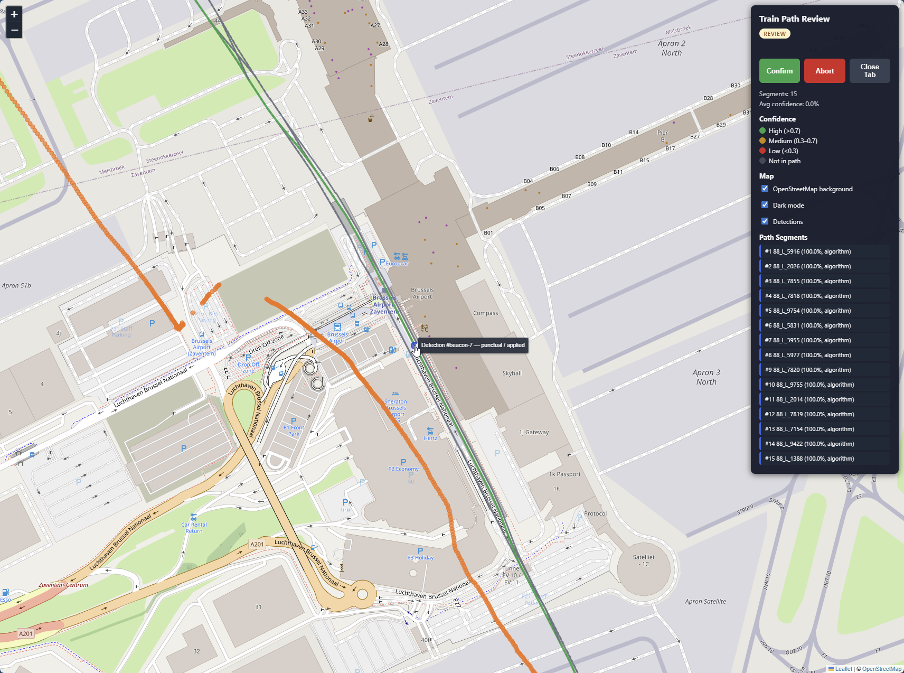

---