# Test data: manually curated data and real train positions

Each log has its own subdirectory (`log_XXXXX/`) containing the source GNSS CSV and the three computed GeoJSON outputs.

- [Test data: manually curated data and real train positions](#test-data-manually-curated-data-and-real-train-positions)
  - [The network file](#the-network-file)
  - [Sample data](#sample-data)
  - [CLI quick reference](#cli-quick-reference)
  - [Easy cases](#easy-cases)
    - [L36 track B – log\_28876](#l36-track-b--log_28876)
      - [The GNSS data](#the-gnss-data)
      - [Simple projection](#simple-projection)
      - [Path calculation](#path-calculation)
      - [Path projection](#path-projection)
    - [L36 track A – log\_29083](#l36-track-a--log_29083)
      - [The GNSS data](#the-gnss-data-1)
      - [Simple projection](#simple-projection-1)
      - [Path calculation](#path-calculation-1)
      - [Path projection](#path-projection-1)
    - [L36-A → L36C-A – log\_28554](#l36-a--l36c-a--log_28554)
      - [Simple projection](#simple-projection-2)
      - [Path calculation](#path-calculation-2)
      - [Path projection](#path-projection-2)
    - [L36-B → L36N-B – log\_29304](#l36-b--l36n-b--log_29304)
      - [Simple projection](#simple-projection-3)
      - [Path calculation](#path-calculation-3)
      - [Path projection](#path-projection-3)
    - [L36C-B → L36-A – log\_30908](#l36c-b--l36-a--log_30908)
      - [Simple projection](#simple-projection-4)
      - [Path calculation](#path-calculation-4)
      - [Path projection](#path-projection-4)
- [Ignore below](#ignore-below)
  - [Single-switch cases](#single-switch-cases)
    - [L25N-B → L36C-B – log\_31176](#l25n-b--l36c-b--log_31176)
      - [Simple projection](#simple-projection-5)
      - [Path calculation](#path-calculation-5)
      - [Path projection](#path-projection-5)
    - [L36-B → L36N-B – log\_32870](#l36-b--l36n-b--log_32870)
      - [Simple projection](#simple-projection-6)
      - [Path calculation](#path-calculation-6)
      - [Path projection](#path-projection-6)
  - [Multi-switch cases](#multi-switch-cases)
    - [L36-B → L36C-B → L25N-A – log\_31241](#l36-b--l36c-b--l25n-a--log_31241)
      - [Simple projection](#simple-projection-7)
      - [Path calculation](#path-calculation-7)
      - [Path projection](#path-projection-7)
    - [L36-A → L36C-A → L25N-B – log\_28573](#l36-a--l36c-a--l25n-b--log_28573)
      - [Simple projection](#simple-projection-8)
      - [Path calculation](#path-calculation-8)
      - [Path projection](#path-projection-8)
    - [L36-A → L36C-A → L25N-B – log\_29493](#l36-a--l36c-a--l25n-b--log_29493)
      - [Simple projection](#simple-projection-9)
      - [Path calculation](#path-calculation-9)
      - [Path projection](#path-projection-9)
    - [L36-A → L36C-A → L25N-B – log\_29584](#l36-a--l36c-a--l25n-b--log_29584)
      - [Simple projection](#simple-projection-10)
      - [Path calculation](#path-calculation-10)
      - [Path projection](#path-projection-10)
    - [L36-A → L36C-A → L25N-B – log\_29835](#l36-a--l36c-a--l25n-b--log_29835)
      - [Simple projection](#simple-projection-11)
      - [Path calculation](#path-calculation-11)
      - [Path projection](#path-projection-11)
    - [L36-A → L36C-A → L25N-B – log\_31259](#l36-a--l36c-a--l25n-b--log_31259)
      - [Simple projection](#simple-projection-12)
      - [Path calculation](#path-calculation-12)
      - [Path projection](#path-projection-12)
  - [Airport branch (L36N)](#airport-branch-l36n)
    - [L36N track A – log\_29224](#l36n-track-a--log_29224)
      - [Simple projection](#simple-projection-13)
      - [Path calculation](#path-calculation-13)
      - [Path projection](#path-projection-13)
    - [L36N track A – log\_30779](#l36n-track-a--log_30779)
      - [Simple projection](#simple-projection-14)
      - [Path calculation](#path-calculation-14)
      - [Path projection](#path-projection-14)
  - [Degraded GNSS cases](#degraded-gnss-cases)
    - [L36-A → L36C-A → L25N-B, very bad GNSS – log\_28586](#l36-a--l36c-a--l25n-b-very-bad-gnss--log_28586)
      - [Simple projection](#simple-projection-15)
      - [Path calculation](#path-calculation-15)
      - [Path projection](#path-projection-15)
    - [L36 track A, very bad GNSS – log\_38373](#l36-track-a-very-bad-gnss--log_38373)
      - [Simple projection](#simple-projection-16)
      - [Path calculation](#path-calculation-16)
      - [Path projection](#path-projection-16)
  - [File reorganisation](#file-reorganisation)

Root folder for release exe: `target/release/`

## The network file

The file `network_airport.geojson` contains a subpart of the Belgian railway network around the airport of Brussels/Zaventem. The tracks going to the airport are underground. At the same time there are tracks above ground but sometimes overcrossed by roads. 

Here's a GIS visualisation containing openstreetmap

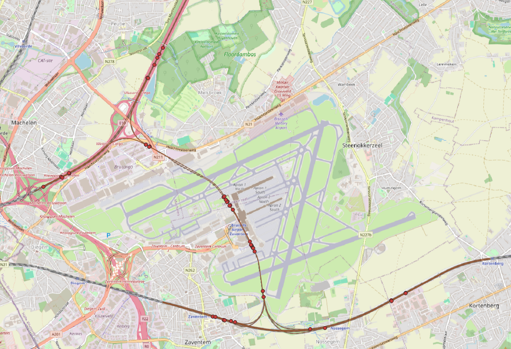

In order to better see the tracks, find below a visualisation without background. Note: the red dots are the netrelations (switches):

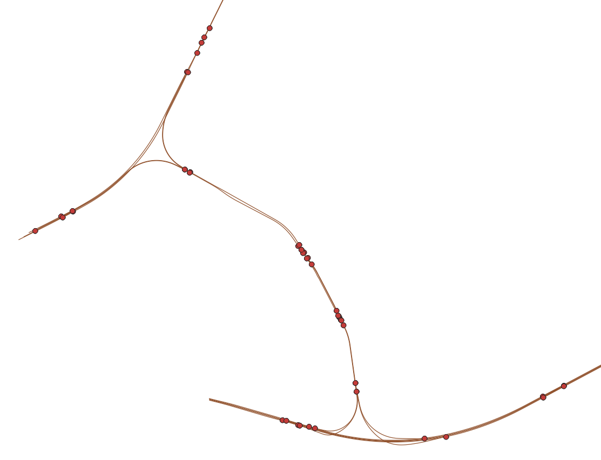

## Sample data

The files `sample_gnss.geojson` and `sample_network.geojson` only serve for educational reasons.

## CLI quick reference

The three operations available via `tp-cli` are:

| Operation | Command | Description |
|-----------|---------|-------------|
| Simple projection | `tp-cli simple-projection ...` | Projects each GNSS point onto the nearest netelement (legacy) |
| Path calculation | `tp-cli calculate-path ...` | Calculates the most likely sequence of netelements without projecting |
| Path projection | `tp-cli ...` (no subcommand) | Full pipeline: calculates path then projects GNSS positions onto it |

Common flags: `--gnss <FILE>`, `--network <FILE>`, `--crs EPSG:4326`, `--output <FILE>` (`.geojson` extension auto-selects GeoJSON format).

## Easy cases

### L36 track B – log_28876

Log file ID: 28876

#### The GNSS data

Relatively clean GNSS data, train traveling from Leuven to Brussels on line 36, track B. The GNSS positions (green) are slightly offset to the north:

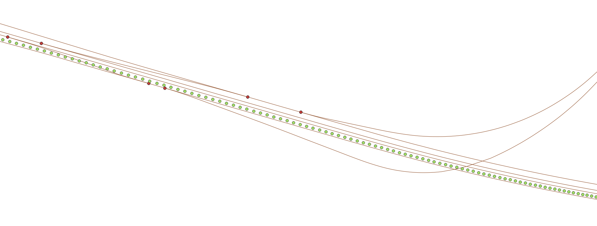

#### Simple projection

Tests to demonstrate how the simple projection works and where it fails (look at North going switches).

```bash
target/release/tp-cli.exe simple-projection --gnss test-data/log_28876/log_28876_L36-B.csv --crs EPSG:4326 --network test-data/network_airport.geojson --output test-data/log_28876/log_28876_L36-B-simple-projection.geojson
```

The result is good, all GNSS positions are projected on the closest netelement. Note that this yields the expected outcome of GNSS projections on connecting tracks (red rectangles) and jumping back to the main track.

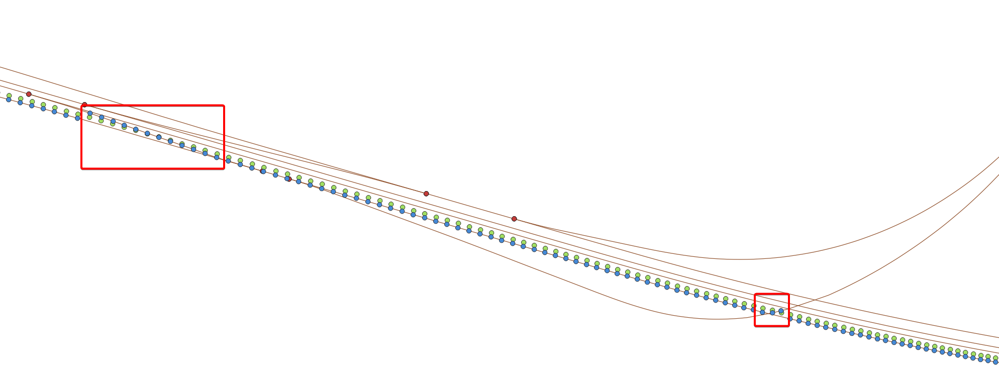

#### Path calculation

Output should be a simple concatenation of all the netelements with a high probability. 

```bash
target/release/tp-cli.exe calculate-path --gnss test-data/log_28876/log_28876_L36-B.csv --crs EPSG:4326 --network test-data/network_airport.geojson --output test-data/log_28876/log_28876_L36-B-path-calculation.geojson
```

Output is correct:
1. 88_L_3842  (prob=0.897)
2. 88_L_5900  (prob=0.855)
3. 88_L_11648 (prob=0.766)
4. 88_L_127   (prob=0.027)
5. 88_L_9748  (prob=0.733)


Note the very low probability for 88_L_127. This is due to it being a very short netelement that connects two switches and only has a very limited number of GPS coordinates on it:


We might need to revise the algorithm later because of this.

#### Path projection

Finally we can evaluate the performance of projecting the coordinates onto the calculated path:

```bash
target/release/tp-cli.exe --gnss test-data/log_28876/log_28876_L36-B.csv --crs EPSG:4326 --network test-data/network_airport.geojson --output test-data/log_28876/log_28876_L36-B-path-projection.geojson
```


In gold the path projected coordinates. In blue the result of the simple projection as reference. We conclude that path projection yields better results than simple projection.

### L36 track A – log_29083

Log file ID: 29083

#### The GNSS data

Relatively dirty GNSS data, train traveling from Brussels to Leuven on line 36, track A. The GNSS positions (green) jump about 200m away from the track center:

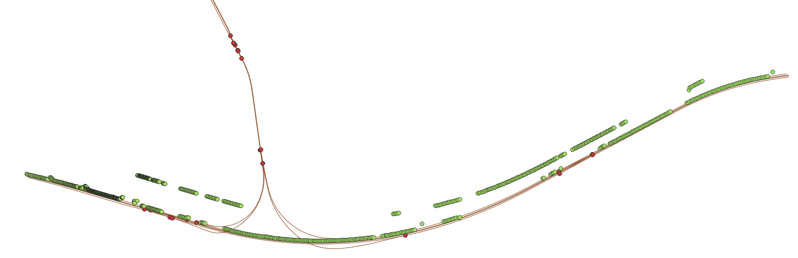

#### Simple projection

```bash
target/release/tp-cli.exe simple-projection --gnss test-data/log_29083/log_29083_L36-A.csv --crs EPSG:4326 --network test-data/network_airport.geojson --output test-data/log_29083/log_29083_L36-A-simple-projection.geojson
```

We see exactly what we would predict, the simple projection algorithm will think the train is going towards the airport station:

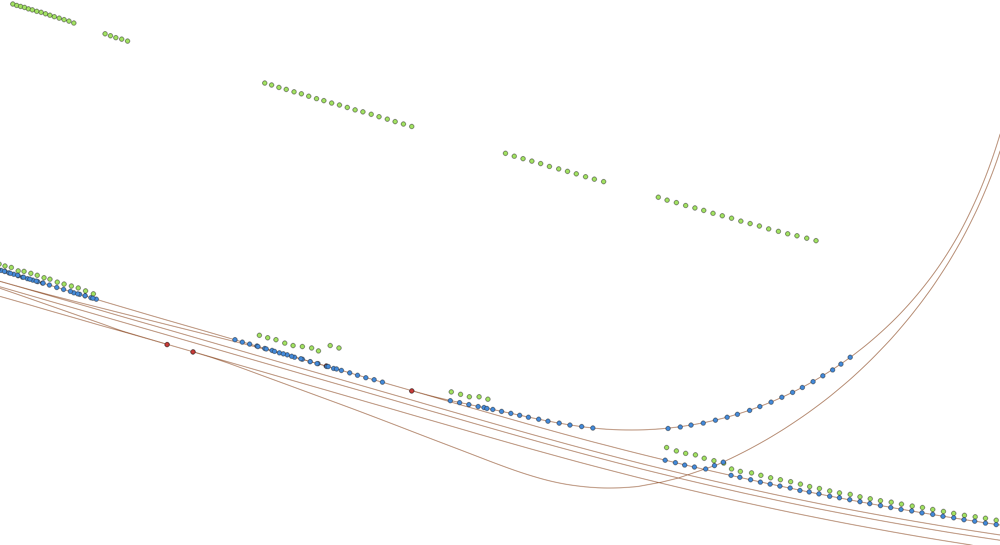

#### Path calculation

```bash
target/release/tp-cli.exe calculate-path --gnss test-data/log_29083/log_29083_L36-A.csv --crs EPSG:4326 --network test-data/network_airport.geojson --output test-data/log_29083/log_29083_L36-A-path-calculation.geojson
```

Output is correct, no surprises:
1. 88_L_5916 (prob=0.629)
2. 88_L_2026  (prob=1.000)
3. 88_L_42    (prob=0.667)
4. 88_L_111   (prob=0.712)
5. 88_L_155   (prob=0.842)

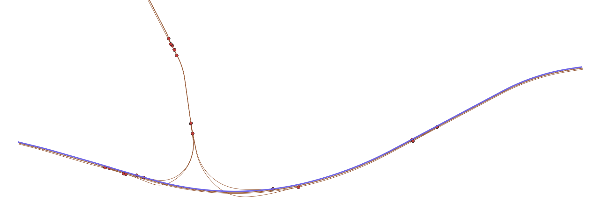

We see a steady probability on all the path elements, even on the short connection between two switches on the main track:

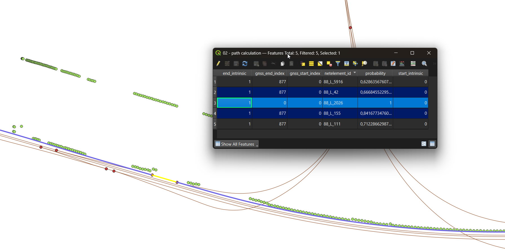

#### Path projection

```bash
target/release/tp-cli.exe --gnss test-data/log_29083/log_29083_L36-A.csv --crs EPSG:4326 --network test-data/network_airport.geojson --output test-data/log_29083/log_29083_L36-A-path-projection.geojson
```

No surprises. The blue dots are again the simple-projection result while the gold dots are the path processed coordinates:

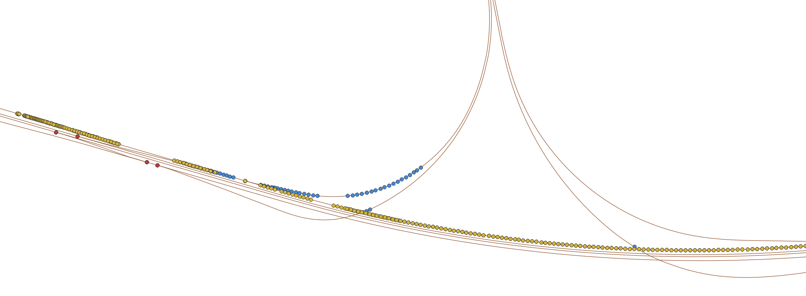


### L36-A → L36C-A – log_28554

Log file ID: 28554

Train takes a single switch from L36 track A onto the L36C line towards the airport (track A). Due to the tunnel, the raw GNSS positions start to drift near the end of the path:

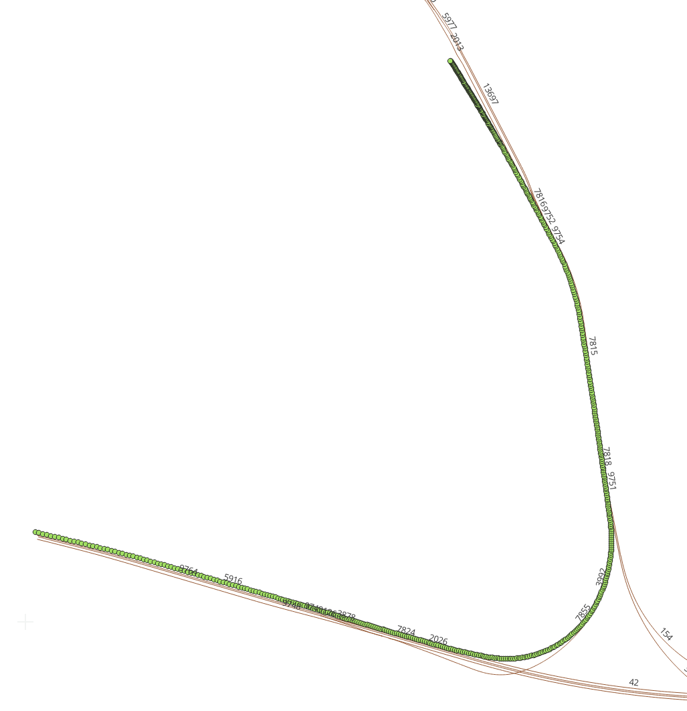

#### Simple projection

Considering the simple layout and path, the simple projection will result already in an optimal result:

```bash
target/release/tp-cli.exe simple-projection --gnss test-data/log_28554/log_28554_L36-A_to_L36C-A.csv --crs EPSG:4326 --network test-data/network_airport.geojson --output test-data/log_28554/log_28554_L36-A_to_L36C-A-simple-projection.geojson
```

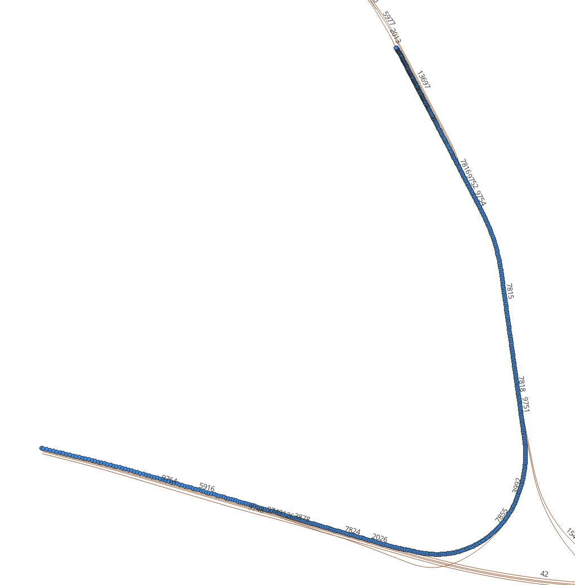

#### Path calculation

Path calculation gives the expected result.

```bash
target/release/tp-cli.exe calculate-path --gnss test-data/log_28554/log_28554_L36-A_to_L36C-A.csv --crs EPSG:4326 --network test-data/network_airport.geojson --output test-data/log_28554/log_28554_L36-A_to_L36C-A-path-calculation.geojson
```

All path elements score a high probability.

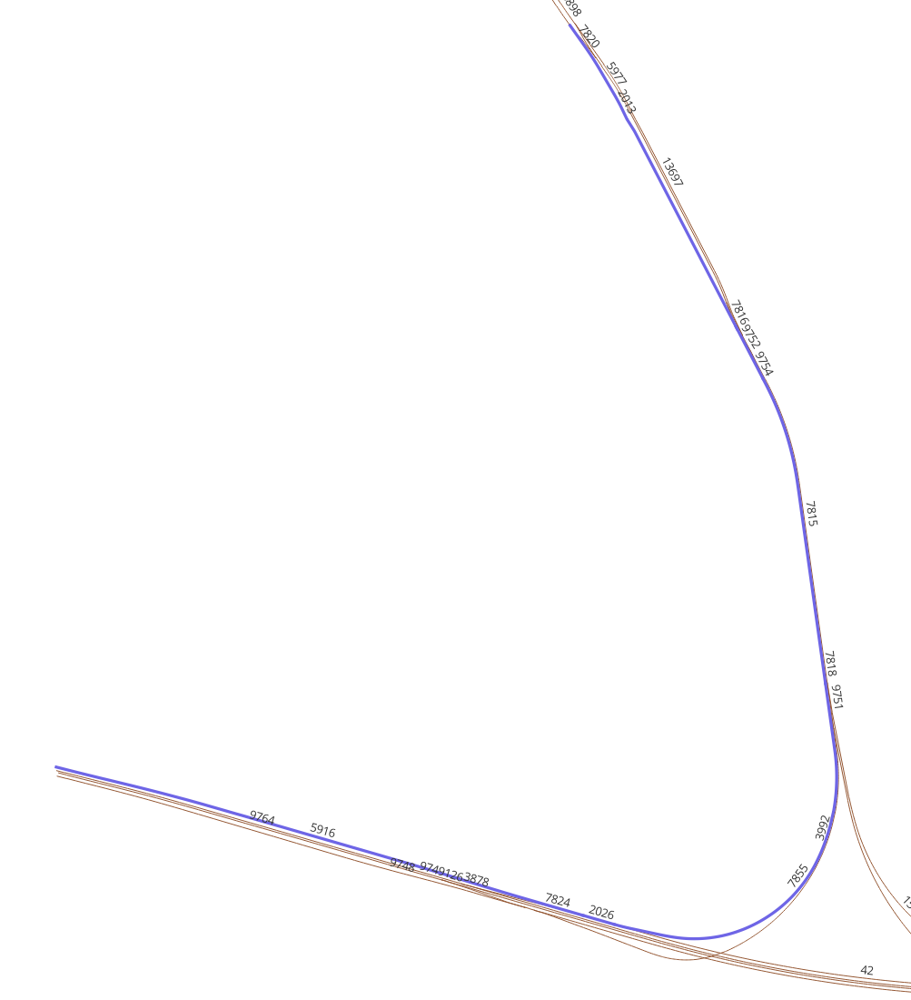

#### Path projection

No surprises here:

```bash
target/release/tp-cli.exe --gnss test-data/log_28554/log_28554_L36-A_to_L36C-A.csv --crs EPSG:4326 --network test-data/network_airport.geojson --output test-data/log_28554/log_28554_L36-A_to_L36C-A-path-projection.geojson
```

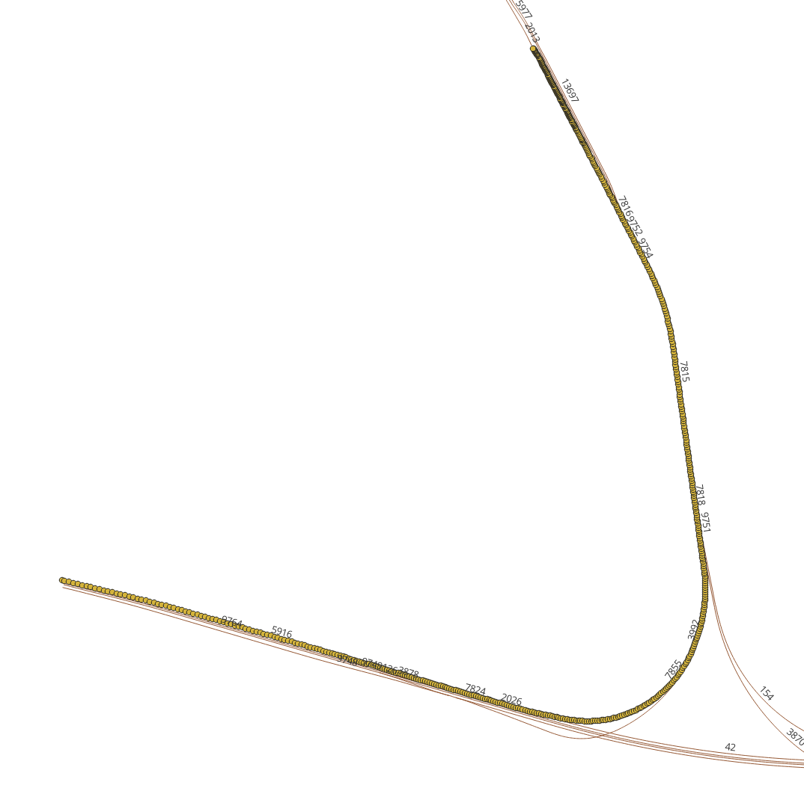


### L36-B → L36N-B – log_29304

Log file ID: 29304

Train drives from Leuven to Brussels, initially driving on L36 track B and moving over to L36N track B after the airport junction. GNSS data is relatively clean:

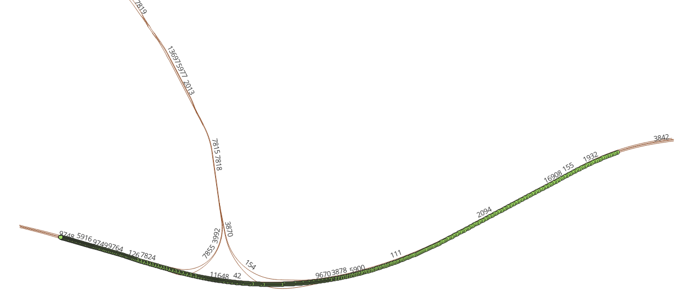

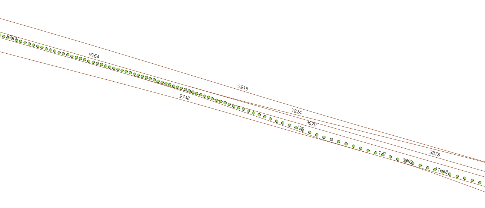

#### Simple projection

```bash
target/release/tp-cli.exe simple-projection --gnss test-data/log_29304/log_29304_L36-B_to_L36N-B.csv --crs EPSG:4326 --network test-data/network_airport.geojson --output test-data/log_29304/log_29304_L36-B_to_L36N-B-simple-projection.geojson
```

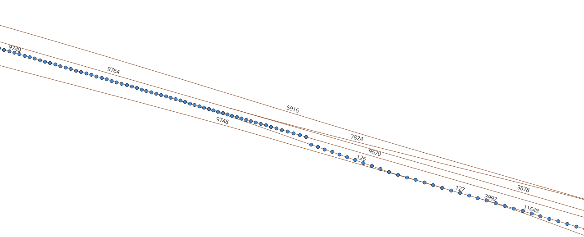

#### Path calculation

```bash
target/release/tp-cli.exe calculate-path --gnss test-data/log_29304/log_29304_L36-B_to_L36N-B.csv --crs EPSG:4326 --network test-data/network_airport.geojson --output test-data/log_29304/log_29304_L36-B_to_L36N-B-path-calculation.geojson
```

Expected output:
1. 88_L_9749  (prob=0.842)
2. 88_L_9670  (prob=0.601)
3. 88_L_16908 (prob=0.592)
4. 88_L_2016  (prob=0.411)
5. 88_L_5900  (prob=0.789)
6. 88_L_3842  (prob=0.807)

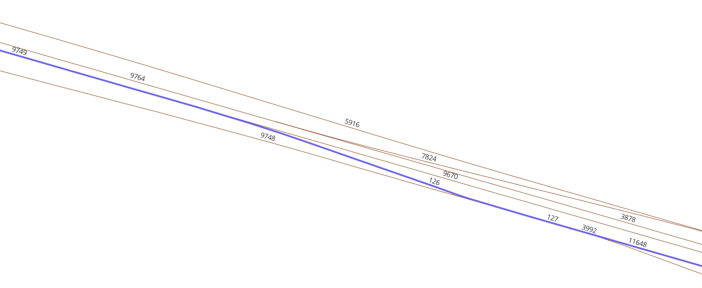

#### Path projection

```bash
target/release/tp-cli.exe --gnss test-data/log_29304/log_29304_L36-B_to_L36N-B.csv --crs EPSG:4326 --network test-data/network_airport.geojson --output test-data/log_29304/log_29304_L36-B_to_L36N-B-path-projection.geojson
```

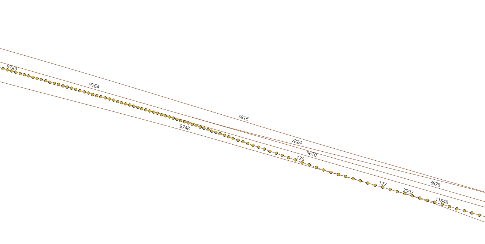

### L36C-B → L36-A – log_30908

Log file ID: 30908

Train starts from L36C track B and merges onto L36 track A. The GNSS positions are very bad at the start until the train is out of the tunnel.

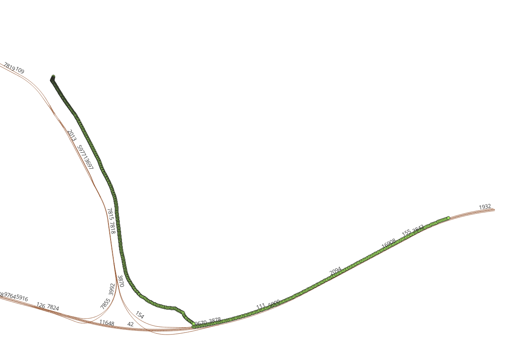

#### Simple projection

```bash
target/release/tp-cli.exe simple-projection --gnss test-data/log_30908/log_30908_L36C-B_to_L36-A.csv --crs EPSG:4326 --network test-data/network_airport.geojson --output test-data/log_30908/log_30908_L36C-B_to_L36-A-simple-projection.geojson
```

Simple projection gives decent results:

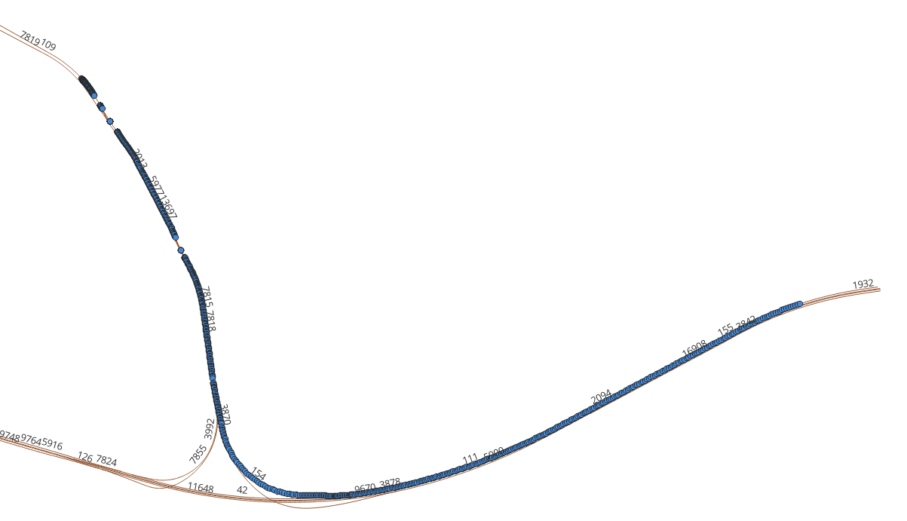

#### Path calculation

```bash
target/release/tp-cli.exe calculate-path --gnss test-data/log_30908/log_30908_L36C-B_to_L36-A.csv --crs EPSG:4326 --network test-data/network_airport.geojson --output test-data/log_30908/log_30908_L36C-B_to_L36-A-path-calculation.geojson
```

Path calculation is as it should be:

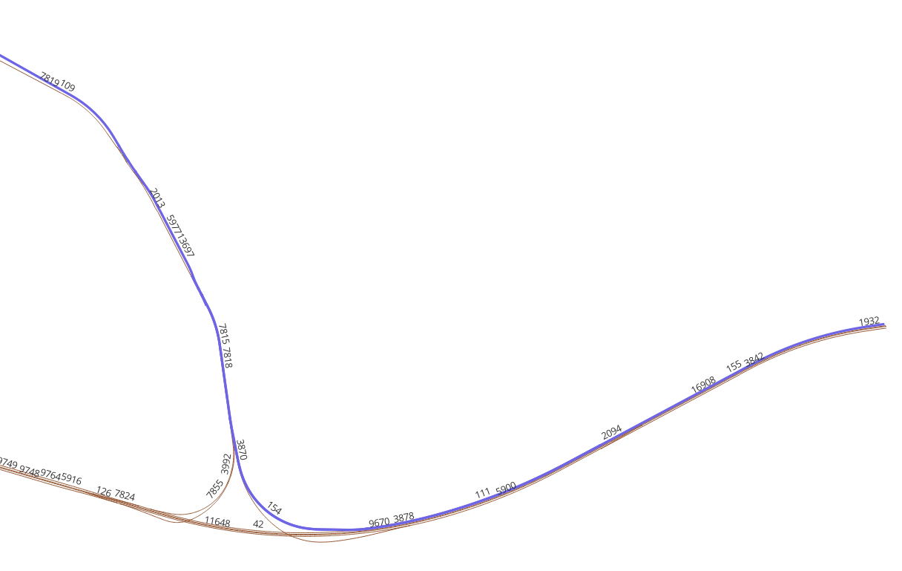

#### Path projection

```bash
target/release/tp-cli.exe --gnss test-data/log_30908/log_30908_L36C-B_to_L36-A.csv --crs EPSG:4326 --network test-data/network_airport.geojson --output test-data/log_30908/log_30908_L36C-B_to_L36-A-path-projection.geojson
```

No surprises with path projection:

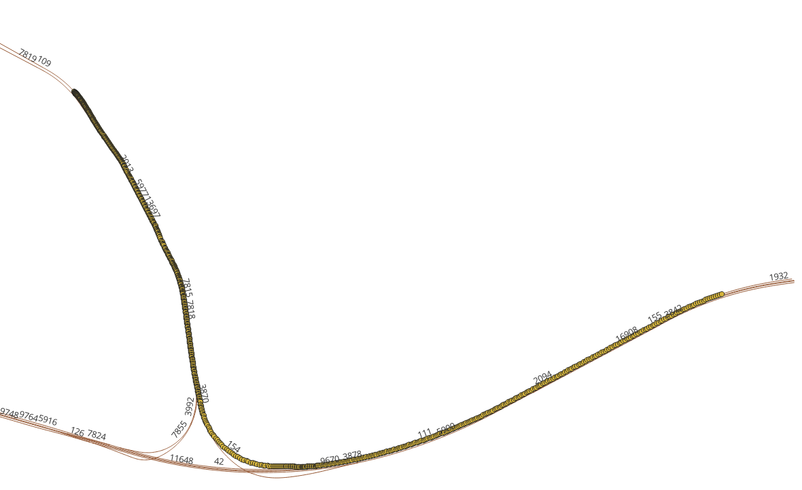

# Ignore below

## Single-switch cases


---


---

### L25N-B → L36C-B – log_31176

Log file ID: 31176

Longer trip starting on L25N track B and joining L36C track B. Contains many segments including several connector netelements.

#### Simple projection

```bash
target/release/tp-cli.exe simple-projection --gnss test-data/log_31176/log_31176_25N-B_to_L36C-B.csv --crs EPSG:4326 --network test-data/network_airport.geojson --output test-data/log_31176/log_31176_25N-B_to_L36C-B-simple-projection.geojson
```

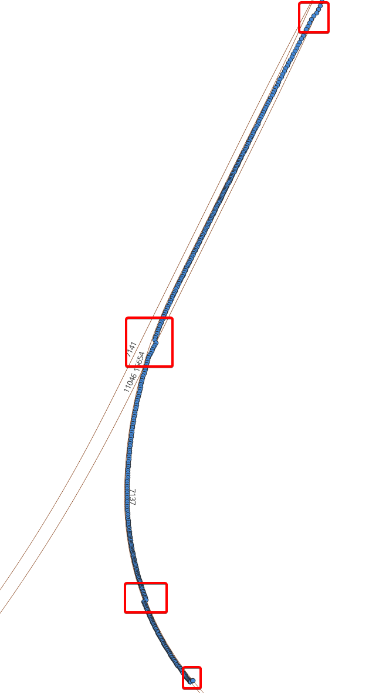

#### Path calculation

```bash
target/release/tp-cli.exe calculate-path --gnss test-data/log_31176/log_31176_25N-B_to_L36C-B.csv --crs EPSG:4326 --network test-data/network_airport.geojson --output test-data/log_31176/log_31176_25N-B_to_L36C-B-path-calculation.geojson
```

Expected output:
1.  88_L_7137  (prob=0.806)
2.  88_L_11885 (prob=0.407)
3.  88_L_11886 (prob=0.530)
4.  88_L_24043 (prob=0.275)
5.  88_L_262   (prob=0.117)
6.  88_L_6041  (prob=0.070)
7.  88_L_6042  (prob=0.319)
8.  88_L_7141  (prob=1.000)
9.  88_L_17875 (prob=1.000)
10. 88_L_1727  (prob=1.000)
11. 88_L_5210  (prob=1.000)
12. 88_L_1728  (prob=1.000)
13. 88_L_18686 (prob=1.000)
14. 88_L_5589  (prob=1.000)
15. 88_L_7154  (prob=1.000)
16. 88_L_7819  (prob=1.000)
17. 88_L_13635 (prob=1.000)
18. 88_L_16654 (prob=0.642)

The first several segments show lower probabilities as the algorithm resolves the switch area around L25N/L36C.

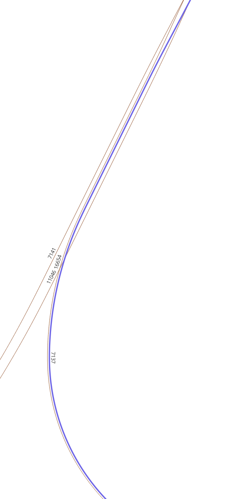

#### Path projection

```bash
target/release/tp-cli.exe --gnss test-data/log_31176/log_31176_25N-B_to_L36C-B.csv --crs EPSG:4326 --network test-data/network_airport.geojson --output test-data/log_31176/log_31176_25N-B_to_L36C-B-path-projection.geojson
```

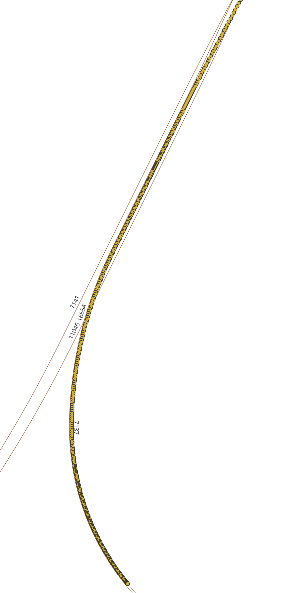

---

### L36-B → L36N-B – log_32870

Log file ID: 32870

A longer version of the L36-B → L36N-B route (compare with log_29304), continuing further along L36N-B and then doubling back on L36C.

#### Simple projection

```bash
target/release/tp-cli.exe simple-projection --gnss test-data/log_32870/log_32870_L36-B_to_L36N-B.csv --crs EPSG:4326 --network test-data/network_airport.geojson --output test-data/log_32870/log_32870_L36-B_to_L36N-B-simple-projection.geojson
```

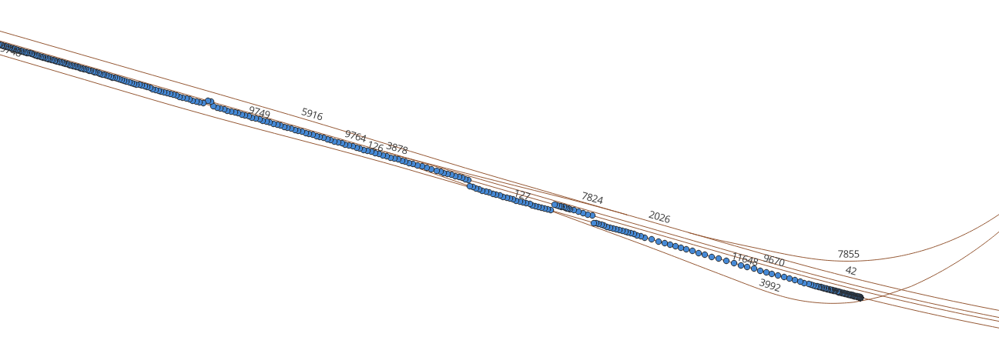

#### Path calculation

```bash
target/release/tp-cli.exe calculate-path --gnss test-data/log_32870/log_32870_L36-B_to_L36N-B.csv --crs EPSG:4326 --network test-data/network_airport.geojson --output test-data/log_32870/log_32870_L36-B_to_L36N-B-path-calculation.geojson
```

Expected output:
1.  88_L_9749  (prob=0.861)
2.  88_L_9670  (prob=0.575)
3.  88_L_16908 (prob=1.000)
4.  88_L_2016  (prob=1.000)
5.  88_L_5900  (prob=1.000)
6.  88_L_11648 (prob=0.576)
7.  88_L_127   (prob=0.031)
8.  88_L_3992  (prob=0.400)
9.  88_L_9751  (prob=1.000)
10. 88_L_7815  (prob=1.000)
11. 88_L_154   (prob=1.000)
12. 88_L_111   (prob=1.000)
13. 88_L_2094  (prob=1.000)
14. 88_L_1932  (prob=1.000)
15. 88_L_3878  (prob=0.374)
16. 88_L_9764  (prob=0.774)
17. 88_L_7824  (prob=1.000)
18. 88_L_2026  (prob=1.000)
19. 88_L_5916  (prob=0.077)

Again `88_L_127` (prob=0.031) is the very short connector between two switches — see note in log_28876.


#### Path projection

```bash
target/release/tp-cli.exe --gnss test-data/log_32870/log_32870_L36-B_to_L36N-B.csv --crs EPSG:4326 --network test-data/network_airport.geojson --output test-data/log_32870/log_32870_L36-B_to_L36N-B-path-projection.geojson
```

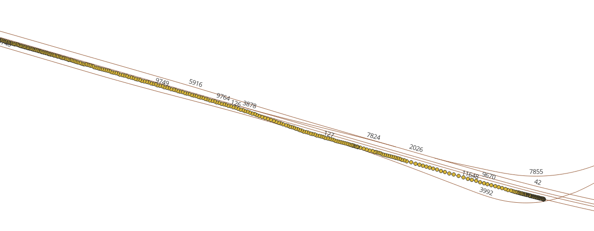

---

## Multi-switch cases

### L36-B → L36C-B → L25N-A – log_31241

Log file ID: 31241

Train takes two switches: from L36 track B onto L36C branch track B, then onto L25N track A.

#### Simple projection

```bash
target/release/tp-cli.exe simple-projection --gnss test-data/log_31241/log_31241_L36-B_to_L36C-B_to_L25N-A.csv --crs EPSG:4326 --network test-data/network_airport.geojson --output test-data/log_31241/log_31241_L36-B_to_L36C-B_to_L25N-A-simple-projection.geojson
```

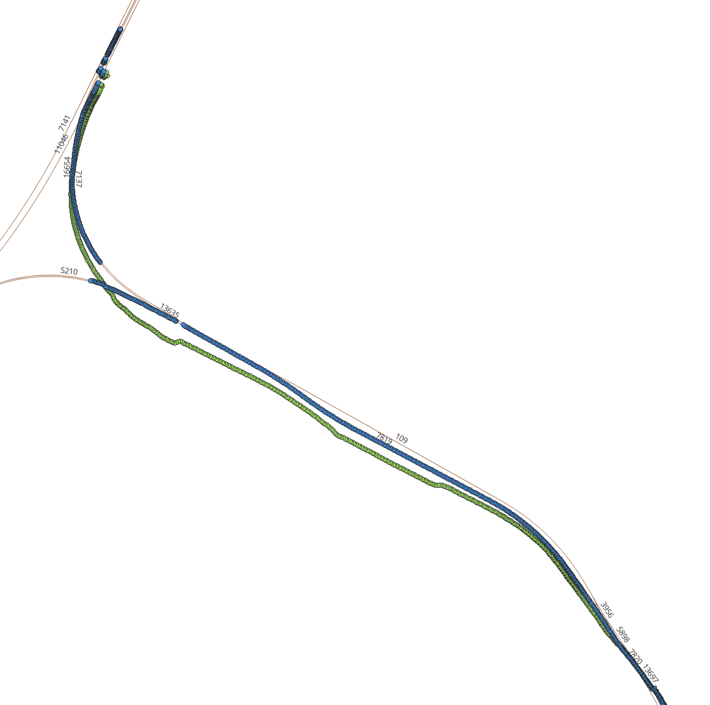

#### Path calculation

```bash
target/release/tp-cli.exe calculate-path --gnss test-data/log_31241/log_31241_L36-B_to_L36C-B_to_L25N-A.csv --crs EPSG:4326 --network test-data/network_airport.geojson --output test-data/log_31241/log_31241_L36-B_to_L36C-B_to_L25N-A-path-calculation.geojson
```

Expected output:
1.  88_L_3842 (prob=0.838)
2.  88_L_5900 (prob=0.826)
3.  88_L_3870 (prob=0.850)
4.  88_L_7817 (prob=0.181)
5.  88_L_7818 (prob=0.667)
6.  88_L_5976 (prob=1.000)
7.  88_L_2010 (prob=1.000)
8.  88_L_7815 (prob=0.712)
9.  88_L_154  (prob=0.302)
10. 88_L_111  (prob=1.000)
11. 88_L_42   (prob=0.050)
12. 88_L_2026 (prob=1.000)
13. 88_L_7855 (prob=0.012)

The very low probabilities on `88_L_7817` (0.181) and `88_L_42` (0.050) are switch connector netelements.

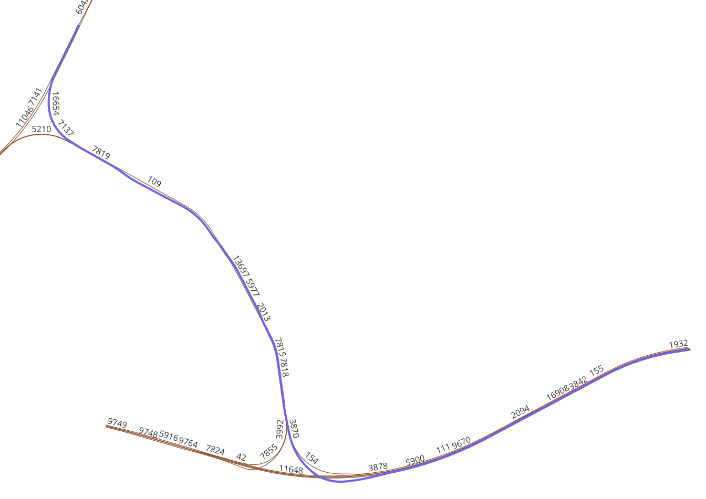

#### Path projection

```bash
target/release/tp-cli.exe --gnss test-data/log_31241/log_31241_L36-B_to_L36C-B_to_L25N-A.csv --crs EPSG:4326 --network test-data/network_airport.geojson --output test-data/log_31241/log_31241_L36-B_to_L36C-B_to_L25N-A-path-projection.geojson
```


---

### L36-A → L36C-A → L25N-B – log_28573

Log file ID: 28573

Train takes two switches: L36 track A → L36C branch track A → L25N track B. This is one of five logs covering the same route (see also 29493, 29584, 29835, 31259).

#### Simple projection

```bash
target/release/tp-cli.exe simple-projection --gnss test-data/log_28573/log_28573_L36-A_to_L36C-A_to_L25N-B.csv --crs EPSG:4326 --network test-data/network_airport.geojson --output test-data/log_28573/log_28573_L36-A_to_L36C-A_to_L25N-B-simple-projection.geojson
```

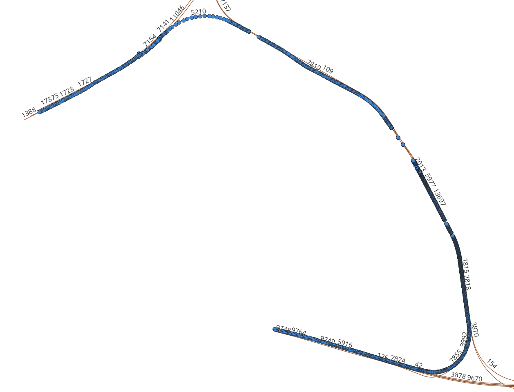

#### Path calculation

```bash
target/release/tp-cli.exe calculate-path --gnss test-data/log_28573/log_28573_L36-A_to_L36C-A_to_L25N-B.csv --crs EPSG:4326 --network test-data/network_airport.geojson --output test-data/log_28573/log_28573_L36-A_to_L36C-A_to_L25N-B-path-calculation.geojson
```

Expected output:
1.  88_L_1388  (prob=0.945)
2.  88_L_11046 (prob=0.475)
3.  88_L_11885 (prob=1.000)
4.  88_L_7137  (prob=1.000)
5.  88_L_109   (prob=1.000)
6.  88_L_11721 (prob=1.000)
7.  88_L_5210  (prob=0.550)
8.  88_L_1727  (prob=1.000)
9.  88_L_17875 (prob=1.000)
10. 88_L_7141  (prob=0.414)
11. 88_L_6042  (prob=1.000)
12. 88_L_16654 (prob=1.000)
13. 88_L_13635 (prob=1.000)
14. 88_L_7819  (prob=1.000)
15. 88_L_7154  (prob=0.675)
16. 88_L_5589  (prob=0.547)
17. 88_L_18686 (prob=0.028)
18. 88_L_1728  (prob=0.342)

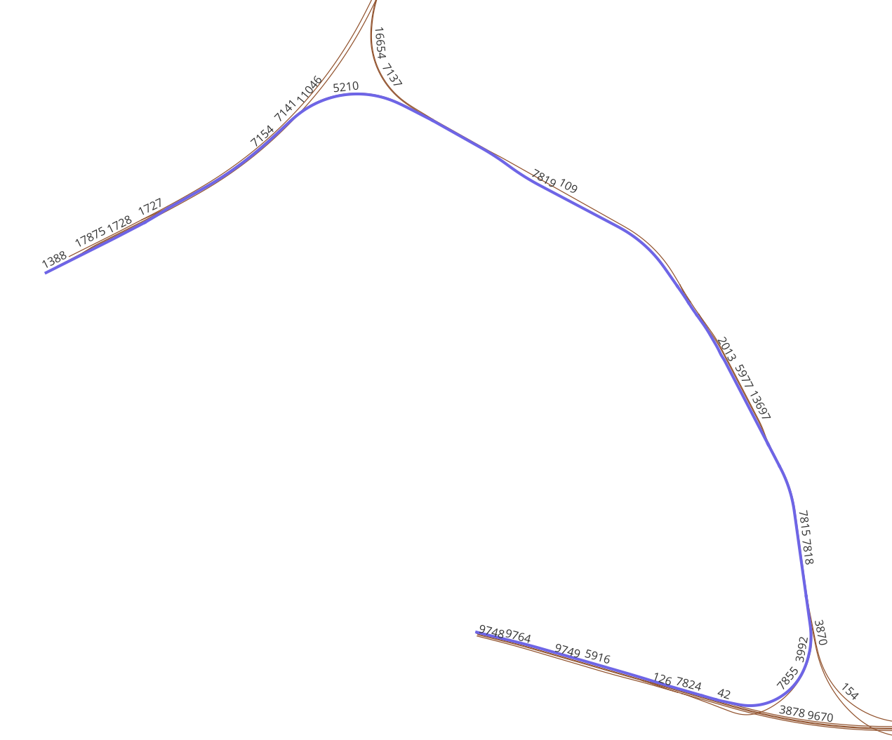

#### Path projection

```bash
target/release/tp-cli.exe --gnss test-data/log_28573/log_28573_L36-A_to_L36C-A_to_L25N-B.csv --crs EPSG:4326 --network test-data/network_airport.geojson --output test-data/log_28573/log_28573_L36-A_to_L36C-A_to_L25N-B-path-projection.geojson
```

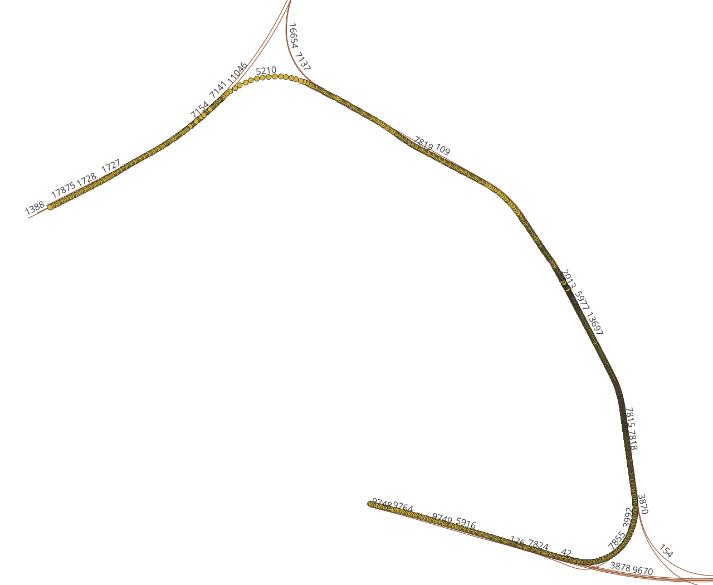

---

### L36-A → L36C-A → L25N-B – log_29493

Log file ID: 29493

Same route as log_28573. Use alongside the other four logs of this route to validate consistency.

#### Simple projection

```bash
target/release/tp-cli.exe simple-projection --gnss test-data/log_29493/log_29493_L36-A_to_L36C-A_to_L25N-B.csv --crs EPSG:4326 --network test-data/network_airport.geojson --output test-data/log_29493/log_29493_L36-A_to_L36C-A_to_L25N-B-simple-projection.geojson
```


#### Path calculation

```bash
target/release/tp-cli.exe calculate-path --gnss test-data/log_29493/log_29493_L36-A_to_L36C-A_to_L25N-B.csv --crs EPSG:4326 --network test-data/network_airport.geojson --output test-data/log_29493/log_29493_L36-A_to_L36C-A_to_L25N-B-path-calculation.geojson
```

Expected output:
1.  88_L_1388  (prob=0.927)
2.  88_L_11046 (prob=0.320)
3.  88_L_11885 (prob=1.000)
4.  88_L_7137  (prob=1.000)
5.  88_L_109   (prob=1.000)
6.  88_L_11721 (prob=1.000)
7.  88_L_5210  (prob=0.345)
8.  88_L_1727  (prob=1.000)
9.  88_L_17875 (prob=1.000)
10. 88_L_7141  (prob=1.000)
11. 88_L_6042  (prob=1.000)
12. 88_L_16654 (prob=1.000)
13. 88_L_13635 (prob=1.000)
14. 88_L_7819  (prob=1.000)
15. 88_L_7154  (prob=0.489)
16. 88_L_5589  (prob=0.484)
17. 88_L_18686 (prob=0.138)
18. 88_L_1728  (prob=0.293)


#### Path projection

```bash
target/release/tp-cli.exe --gnss test-data/log_29493/log_29493_L36-A_to_L36C-A_to_L25N-B.csv --crs EPSG:4326 --network test-data/network_airport.geojson --output test-data/log_29493/log_29493_L36-A_to_L36C-A_to_L25N-B-path-projection.geojson
```


---

### L36-A → L36C-A → L25N-B – log_29584

Log file ID: 29584

Same route as log_28573.

#### Simple projection

```bash
target/release/tp-cli.exe simple-projection --gnss test-data/log_29584/log_29584_L36-A_to_L36C-A_to_L25N-B.csv --crs EPSG:4326 --network test-data/network_airport.geojson --output test-data/log_29584/log_29584_L36-A_to_L36C-A_to_L25N-B-simple-projection.geojson
```

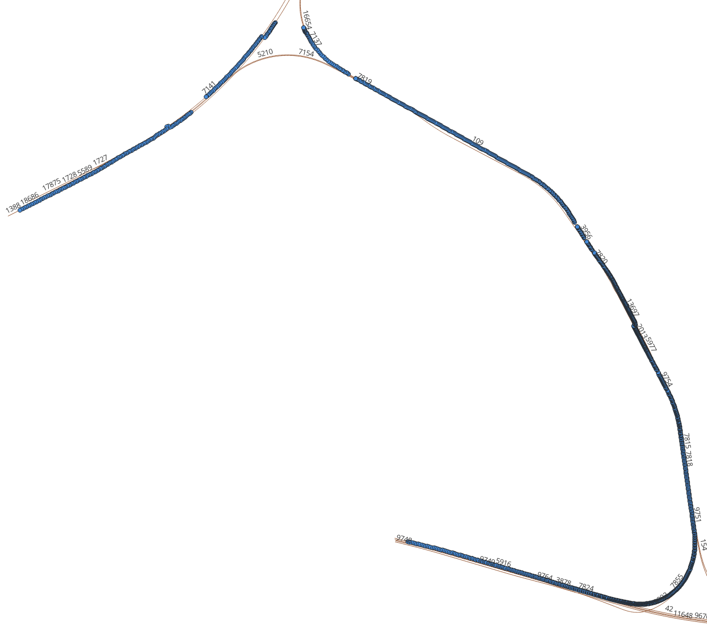

#### Path calculation

```bash
target/release/tp-cli.exe calculate-path --gnss test-data/log_29584/log_29584_L36-A_to_L36C-A_to_L25N-B.csv --crs EPSG:4326 --network test-data/network_airport.geojson --output test-data/log_29584/log_29584_L36-A_to_L36C-A_to_L25N-B-path-calculation.geojson
```

Expected output:
1.  88_L_1388  (prob=0.965)
2.  88_L_11046 (prob=0.414)
3.  88_L_11885 (prob=1.000)
4.  88_L_7137  (prob=1.000)
5.  88_L_109   (prob=1.000)
6.  88_L_11721 (prob=1.000)
7.  88_L_5210  (prob=0.552)
8.  88_L_1727  (prob=1.000)
9.  88_L_17875 (prob=1.000)
10. 88_L_7141  (prob=0.327)
11. 88_L_6042  (prob=1.000)
12. 88_L_16654 (prob=1.000)
13. 88_L_13635 (prob=1.000)
14. 88_L_7819  (prob=1.000)
15. 88_L_7154  (prob=0.677)
16. 88_L_5589  (prob=0.506)
17. 88_L_18686 (prob=0.147)
18. 88_L_1728  (prob=0.311)

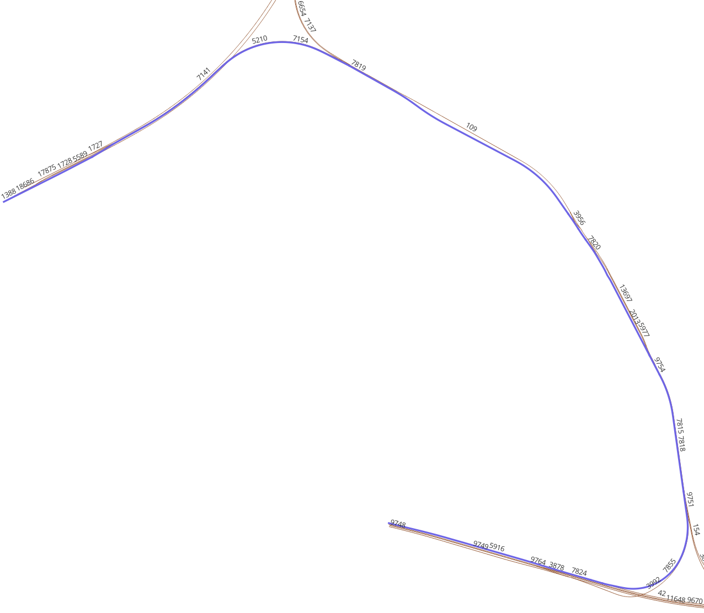

#### Path projection

```bash
target/release/tp-cli.exe --gnss test-data/log_29584/log_29584_L36-A_to_L36C-A_to_L25N-B.csv --crs EPSG:4326 --network test-data/network_airport.geojson --output test-data/log_29584/log_29584_L36-A_to_L36C-A_to_L25N-B-path-projection.geojson
```

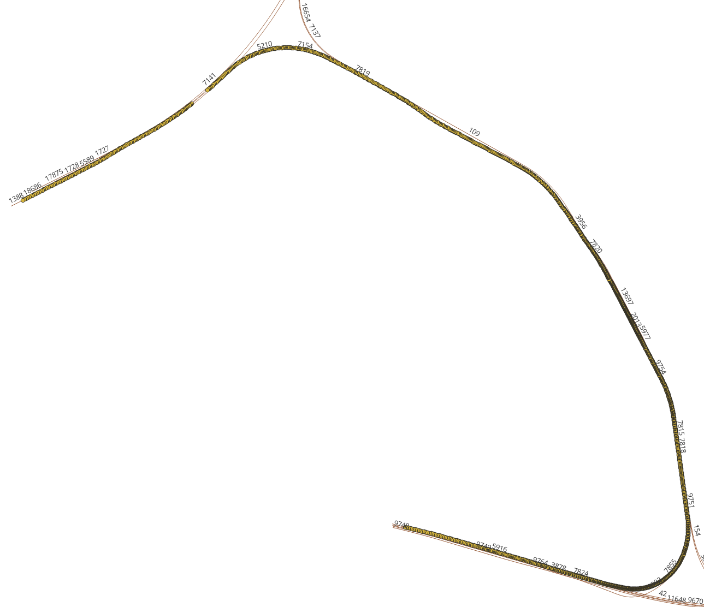

---

### L36-A → L36C-A → L25N-B – log_29835

Log file ID: 29835

Same route as log_28573, but the GNSS data only covers a partial segment of the journey (the path calculation resolves only the first switch area, not the full route to L25N-B).

#### Simple projection

```bash
target/release/tp-cli.exe simple-projection --gnss test-data/log_29835/log_29835_L36-A_to_L36C-A_to_L25N-B.csv --crs EPSG:4326 --network test-data/network_airport.geojson --output test-data/log_29835/log_29835_L36-A_to_L36C-A_to_L25N-B-simple-projection.geojson
```

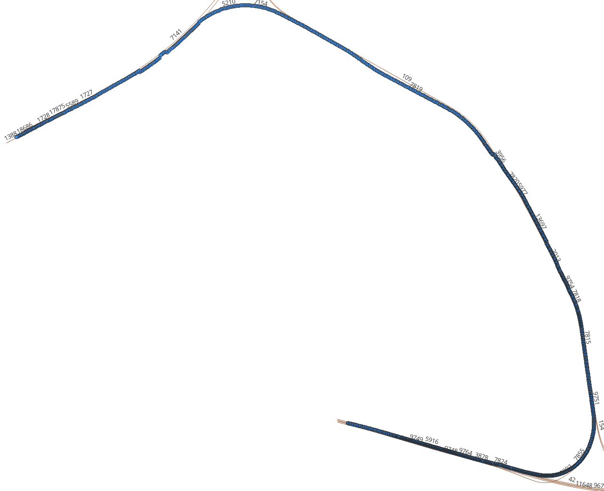

#### Path calculation

```bash
target/release/tp-cli.exe calculate-path --gnss test-data/log_29835/log_29835_L36-A_to_L36C-A_to_L25N-B.csv --crs EPSG:4326 --network test-data/network_airport.geojson --output test-data/log_29835/log_29835_L36-A_to_L36C-A_to_L25N-B-path-calculation.geojson
```

Expected output (partial route — GNSS data ends before reaching L25N-B):
1. 88_L_9764 (prob=0.917)
2. 88_L_7824 (prob=0.465)
3. 88_L_2026 (prob=0.113)
4. 88_L_7855 (prob=0.925)
5. 88_L_7818 (prob=0.927)

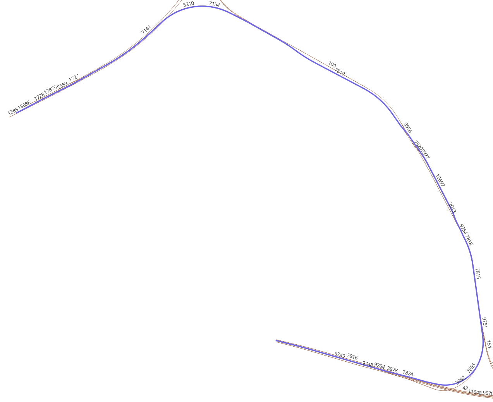

#### Path projection

```bash
target/release/tp-cli.exe --gnss test-data/log_29835/log_29835_L36-A_to_L36C-A_to_L25N-B.csv --crs EPSG:4326 --network test-data/network_airport.geojson --output test-data/log_29835/log_29835_L36-A_to_L36C-A_to_L25N-B-path-projection.geojson
```

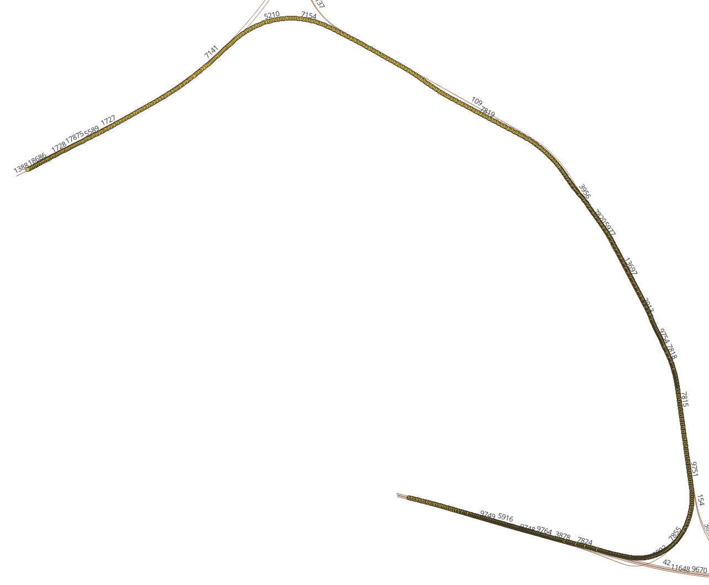

---

### L36-A → L36C-A → L25N-B – log_31259

Log file ID: 31259

Same route as log_28573. The path calculation resolves fewer segments than the other four logs of this route — the GNSS coverage ends earlier on the L25N-B leg.

#### Simple projection

```bash
target/release/tp-cli.exe simple-projection --gnss test-data/log_31259/log_31259_L36-A_to_L36C-A_to_L25N-B.csv --crs EPSG:4326 --network test-data/network_airport.geojson --output test-data/log_31259/log_31259_L36-A_to_L36C-A_to_L25N-B-simple-projection.geojson
```


#### Path calculation

```bash
target/release/tp-cli.exe calculate-path --gnss test-data/log_31259/log_31259_L36-A_to_L36C-A_to_L25N-B.csv --crs EPSG:4326 --network test-data/network_airport.geojson --output test-data/log_31259/log_31259_L36-A_to_L36C-A_to_L25N-B-path-calculation.geojson
```

Expected output:
1.  88_L_1388  (prob=0.957)
2.  88_L_11046 (prob=0.558)
3.  88_L_11885 (prob=1.000)
4.  88_L_7137  (prob=1.000)
5.  88_L_109   (prob=1.000)
6.  88_L_11721 (prob=1.000)
7.  88_L_5210  (prob=0.285)
8.  88_L_1728  (prob=0.316)
9.  88_L_18686 (prob=0.139)
10. 88_L_5589  (prob=0.501)
11. 88_L_7154  (prob=0.388)


#### Path projection

```bash
target/release/tp-cli.exe --gnss test-data/log_31259/log_31259_L36-A_to_L36C-A_to_L25N-B.csv --crs EPSG:4326 --network test-data/network_airport.geojson --output test-data/log_31259/log_31259_L36-A_to_L36C-A_to_L25N-B-path-projection.geojson
```


---

## Airport branch (L36N)

### L36N track A – log_29224

Log file ID: 29224

Train traveling on the L36N airport branch, track A (underground tunnel beneath the airport).

#### Simple projection

```bash
target/release/tp-cli.exe simple-projection --gnss test-data/log_29224/log_29224_L36N-A.csv --crs EPSG:4326 --network test-data/network_airport.geojson --output test-data/log_29224/log_29224_L36N-A-simple-projection.geojson
```


#### Path calculation

```bash
target/release/tp-cli.exe calculate-path --gnss test-data/log_29224/log_29224_L36N-A.csv --crs EPSG:4326 --network test-data/network_airport.geojson --output test-data/log_29224/log_29224_L36N-A-path-calculation.geojson
```

Expected output:
1. 88_L_1932 (prob=0.930)
2. 88_L_3878 (prob=0.946)
3. 88_L_9764 (prob=0.925)
4. 88_L_7824 (prob=0.400)
5. 88_L_2026 (prob=0.048)
6. 88_L_42   (prob=0.488)
7. 88_L_111  (prob=0.395)
8. 88_L_155  (prob=0.433)


#### Path projection

```bash
target/release/tp-cli.exe --gnss test-data/log_29224/log_29224_L36N-A.csv --crs EPSG:4326 --network test-data/network_airport.geojson --output test-data/log_29224/log_29224_L36N-A-path-projection.geojson
```


---

### L36N track A – log_30779

Log file ID: 30779

Second log of the L36N airport branch, track A. Slightly different segment coverage than log_29224 at the far end.

#### Simple projection

```bash
target/release/tp-cli.exe simple-projection --gnss test-data/log_30779/log_30779_L36N-A.csv --crs EPSG:4326 --network test-data/network_airport.geojson --output test-data/log_30779/log_30779_L36N-A-simple-projection.geojson
```


#### Path calculation

```bash
target/release/tp-cli.exe calculate-path --gnss test-data/log_30779/log_30779_L36N-A.csv --crs EPSG:4326 --network test-data/network_airport.geojson --output test-data/log_30779/log_30779_L36N-A-path-calculation.geojson
```

Expected output:
1. 88_L_9764 (prob=0.900)
2. 88_L_3878 (prob=0.909)
3. 88_L_1932 (prob=0.848)
4. 88_L_2094 (prob=0.320)
5. 88_L_111  (prob=0.362)
6. 88_L_42   (prob=0.427)
7. 88_L_2026 (prob=0.049)
8. 88_L_5916 (prob=0.342)


#### Path projection

```bash
target/release/tp-cli.exe --gnss test-data/log_30779/log_30779_L36N-A.csv --crs EPSG:4326 --network test-data/network_airport.geojson --output test-data/log_30779/log_30779_L36N-A-path-projection.geojson
```


---

## Degraded GNSS cases

These logs have heavily corrupted GNSS data. Despite the degraded input, the path calculation algorithm should still find the correct route (or the most plausible route given the available evidence).

### L36-A → L36C-A → L25N-B, very bad GNSS – log_28586

Log file ID: 28586

Same route as log_28573 but with severely degraded GNSS data. The algorithm is expected to find the same netelement sequence despite the noise.

#### Simple projection

```bash
target/release/tp-cli.exe simple-projection --gnss test-data/log_28586/log_28586_L36-A_to_L36C-A_to_L25N-B-very-bad.csv --crs EPSG:4326 --network test-data/network_airport.geojson --output test-data/log_28586/log_28586_L36-A_to_L36C-A_to_L25N-B-very-bad-simple-projection.geojson
```

Expected to produce many erroneous projections onto adjacent netelements.


#### Path calculation

```bash
target/release/tp-cli.exe calculate-path --gnss test-data/log_28586/log_28586_L36-A_to_L36C-A_to_L25N-B-very-bad.csv --crs EPSG:4326 --network test-data/network_airport.geojson --output test-data/log_28586/log_28586_L36-A_to_L36C-A_to_L25N-B-very-bad-path-calculation.geojson
```

Expected output (same route as log_28573 — the path algorithm recovers fully despite the noise):
1.  88_L_1388  (prob=0.892)
2.  88_L_11046 (prob=0.561)
3.  88_L_11885 (prob=1.000)
4.  88_L_7137  (prob=1.000)
5.  88_L_109   (prob=1.000)
6.  88_L_11721 (prob=1.000)
7.  88_L_5210  (prob=0.612)
8.  88_L_1727  (prob=1.000)
9.  88_L_17875 (prob=1.000)
10. 88_L_7141  (prob=0.387)
11. 88_L_6042  (prob=1.000)
12. 88_L_16654 (prob=1.000)
13. 88_L_13635 (prob=1.000)
14. 88_L_7819  (prob=1.000)
15. 88_L_7154  (prob=0.621)
16. 88_L_5589  (prob=0.585)
17. 88_L_18686 (prob=0.031)
18. 88_L_1728  (prob=0.376)


#### Path projection

```bash
target/release/tp-cli.exe --gnss test-data/log_28586/log_28586_L36-A_to_L36C-A_to_L25N-B-very-bad.csv --crs EPSG:4326 --network test-data/network_airport.geojson --output test-data/log_28586/log_28586_L36-A_to_L36C-A_to_L25N-B-very-bad-path-projection.geojson
```


---

### L36 track A, very bad GNSS – log_38373

Log file ID: 38373

Degraded GNSS data on L36 track A (no switches). The path calculation finds a plausible route but the low probability values reflect the poor signal quality.

#### Simple projection

```bash
target/release/tp-cli.exe simple-projection --gnss test-data/log_38373/log_38373_L36-A-very-bad.csv --crs EPSG:4326 --network test-data/network_airport.geojson --output test-data/log_38373/log_38373_L36-A-very-bad-simple-projection.geojson
```


#### Path calculation

```bash
target/release/tp-cli.exe calculate-path --gnss test-data/log_38373/log_38373_L36-A-very-bad.csv --crs EPSG:4326 --network test-data/network_airport.geojson --output test-data/log_38373/log_38373_L36-A-very-bad-path-calculation.geojson
```

Expected output:
1. 88_L_5916 (prob=0.396)
2. 88_L_2026 (prob=1.000)
3. 88_L_42   (prob=0.180)
4. 88_L_111  (prob=1.000)
5. 88_L_2094 (prob=1.000)
6. 88_L_1932 (prob=1.000)
7. 88_L_3878 (prob=0.777)
8. 88_L_9764 (prob=0.845)

Note: the path diverges from clean L36-A logs (e.g., log_29083) in the later segments (`88_L_2094, 88_L_1932, 88_L_3878, 88_L_9764`), following the L36N-A branch instead of continuing purely on L36-A. This is a known limitation with very sparse GNSS data where the algorithm cannot distinguish between adjacent tracks.


#### Path projection

```bash
target/release/tp-cli.exe --gnss test-data/log_38373/log_38373_L36-A-very-bad.csv --crs EPSG:4326 --network test-data/network_airport.geojson --output test-data/log_38373/log_38373_L36-A-very-bad-path-projection.geojson
```


---

## File reorganisation

All source GNSS files and computed outputs are organized into per-log subdirectories (`log_XXXXX/`). The helper scripts (`move_files.ps1`, `run_calculations.ps1`, `extract_paths.ps1`) at the root of this directory were used to generate the current structure and can be removed once no longer needed.
